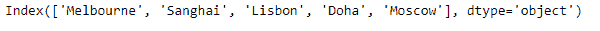

# Python | Pandas index . is _ unique

> 原文:[https://www . geesforgeks . org/python-pandas-index-is _ unique/](https://www.geeksforgeeks.org/python-pandas-index-is_unique/)

熊猫索引是一个实现有序的、可切片的集合的不可变数组。它是存储所有熊猫对象的轴标签的基本对象。

熊猫 `**Index.is_unique**`属性返回`True`如果给定索引对象中的基础数据是唯一的，则返回`False`。

> **语法:** Index.is_unique
> 
> **参数:**无
> 
> **返回:**布尔值

**示例#1:** 使用`Index.is_unique`属性找出给定索引对象中的基础数据是否唯一。

```py
# importing pandas as pd
import pandas as pd

# Creating the index
idx = pd.Index(['Melbourne', 'Sanghai', 'Lisbon', 'Doha', 'Moscow'])

# Print the index
print(idx)
```

**输出:**


现在我们将使用`Index.is_unique`属性来找出给定索引对象中的底层数据是否唯一。

```py
# check if the values in the Index
# is unique or not.
result = idx.is_unique

# Print the result
print(result)
```

**输出:**


正如我们在输出中看到的那样，`Index.is_unique`属性已经返回了`True`，表明给定 Index 对象的底层数据是唯一的。

**示例 2 :** 使用`Index.is_unique`属性找出给定索引对象中的底层数据是否唯一。

```py
# importing pandas as pd
import pandas as pd

# Creating the index
idx = pd.Index([900, 700, 620, 388, 900])

# Print the index
print(idx)
```

**输出:**


现在我们将使用`Index.is_unique`属性来找出给定索引对象中的底层数据是否唯一。

```py
# check if the values in the Index
# is unique or not.
result = idx.is_unique

# Print the result
print(result)
```

**输出:**

正如我们在输出中看到的，`Index.is_unique`属性已经返回了`False`，表明给定 Index 对象的底层数据不是唯一的。