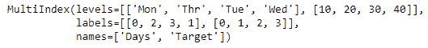

# Python | Pandas index . isin()

> 原文:[https://www.geeksforgeeks.org/python-pandas-index-isin/](https://www.geeksforgeeks.org/python-pandas-index-isin/)

Python 是进行数据分析的优秀语言，主要是因为以数据为中心的 python 包的奇妙生态系统。 ***【熊猫】*** 就是其中一个包，让导入和分析数据变得容易多了。

Pandas **Index.isin()** 函数返回一个布尔数组，其中索引值以值的形式出现。计算是否在传递的值集中找到每个索引值的布尔数组。返回的布尔数组的长度与索引的长度匹配。

> **语法:** Index.isin(值，级别=无)
> **参数:**
> **值:**【集合或列表式】搜索值。
> **级别:**要使用的索引级别的名称或位置(如果索引是多索引)。
> **返回:** NumPy 布尔值数组。

**示例#1:** 使用 Index.isin()函数检查索引值是否存在于传递的值列表中。

## 蟒蛇 3

```
# importing pandas as pd
import pandas as pd

# Creating the Index
idx = pd.Index(['Labrador', 'Beagle', 'Mastiff',
                    'Lhasa', 'Husky', 'Beagle'])

# Print the Index
idx
```

**输出:**


现在我们发现索引标签是否存在于传递的列表中。

## 蟒蛇 3

```
# Passing a list containing two values against
#  which the index labels will be matched
idx.isin(['Lhasa', 'Mastiff'])
```

**输出:**


该函数返回一个数组对象，其大小与索引的大小相同。True 值表示索引标签存在于传递的列表对象中，False 值表示索引标签不存在于传递的列表对象中。

**示例 2:** 使用 Index.isin()函数检查多索引的标签是否存在于传递的列表中。

## 蟒蛇 3

```
# importing pandas as pd
import pandas as pd

# Creating the MultiIndex
midx = pd.MultiIndex.from_arrays([['Mon', 'Tue', 'Wed', 'Thr'],
                 [10, 20, 30, 40]], names =('Days', 'Target'))

# Print the MultiIndex
midx
```

**输出:**



现在我们将检查多索引中的标签是否存在于传递的列表中。

## 蟒蛇 3

```
# test whether midx labels are in list or not
midx.isin(['Tue', 'Wed', 'Fri', 'Sat'], level ='Days')
```

**输出:**


正如我们在输出中看到的，该函数返回了一个数组对象，其大小与 MultiIndex 选定级别的大小相同。True 值表示索引标签存在于传递的列表对象中，False 值表示索引标签不存在于传递的列表对象中。