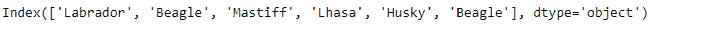
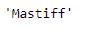
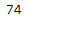

# Python | Pandas Index.max()

> 原文:[https://www.geeksforgeeks.org/python-pandas-index-max/](https://www.geeksforgeeks.org/python-pandas-index-max/)

Python 是进行数据分析的优秀语言，主要是因为以数据为中心的 python 包的奇妙生态系统。 ***【熊猫】*** 就是其中一个包，让导入和分析数据变得容易多了。

熊猫 `**Index.max()**`函数返回索引的最大值。该函数既适用于数值型对象，也适用于字符串型对象。在字符串类型对象的情况下，它返回在字典顺序中具有最高值的字符串。

> **语法:** Index.max()
> 
> **参数:**不取任何参数。
> 
> **返回:**标量:最大值。

**示例#1:** 使用`Index.max()`函数查找给定索引中的最大元素。

```
# importing pandas as pd
import pandas as pd

# Creating the Index
idx = pd.Index(['Labrador', 'Beagle', 'Mastiff', 'Lhasa', 'Husky', 'Beagle'])

# Print the Index
idx
```

**输出:**


现在我们找到给定索引中的最大值。

```
# return max value.
idx.max()
```

**输出:**

正如我们在输出中看到的，函数返回了‘Mastiff’，它在 Index 中存在的值中具有最高的字典顺序。

**示例 2:** 使用`Index.max()`函数在索引中查找最大值。

```
# importing pandas as pd
import pandas as pd

# Creating the Index
idx = pd.Index([17, 69, 33, 5, 0, 74, 0])

# Print the Datetime Index
idx
```

**输出:**


现在我们将在索引的标签中找到最大值。

```
# the function will return the
# maximum value present in the Index
idx.max()
```

**输出:**


正如我们在输出中看到的，函数返回了 74，这是索引标签中最大的值。