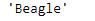
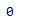

# 蟒蛇|熊猫 Index.min()

> 原文:[https://www.geeksforgeeks.org/python-pandas-index-min/](https://www.geeksforgeeks.org/python-pandas-index-min/)

Python 是进行数据分析的优秀语言，主要是因为以数据为中心的 python 包的奇妙生态系统。 ***【熊猫】*** 就是其中一个包，让导入和分析数据变得容易多了。

熊猫 `**Index.min()**`函数返回索引的最小值。该函数既适用于数值型对象，也适用于字符串型对象。在字符串类型对象的情况下，它返回字典顺序中值最小的字符串。

> **语法:** Index.min()
> 
> **参数:**不取任何参数。
> 
> **返回:**标量:最小值。

**示例#1:** 使用`Index.min()`函数在给定的索引中查找最小元素。

```py
# importing pandas as pd
import pandas as pd

# Creating the Index
idx = pd.Index(['Labrador', 'Beagle', 'Mastiff', 'Lhasa', 'Husky', 'Beagle'])

# Print the Index
idx
```

**输出:**


现在我们在给定的索引中找到最小值。

```py
# return min value.
idx.min()
```

**输出:**

正如我们在输出中看到的，该函数返回了“Beagle”，它在索引中存在的值中具有最小的字典顺序。

**示例 2:** 使用`Index.min()`函数在索引中查找最小值。

```py
# importing pandas as pd
import pandas as pd

# Creating the Index
idx = pd.Index([17, 69, 33, 5, 0, 74, 0])

# Print the Datetime Index
idx
```

**输出:**


现在我们将在索引的标签中找到最小值。

```py
# the function will return the minimum
#  value present in the Index
idx.min()
```

**输出:**

正如我们在输出中看到的，函数返回了 0，这是 Index 标签中的最小值。