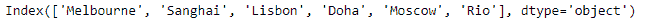

# 蟒蛇|熊猫索引

> 原文:[https://www.geeksforgeeks.org/python-pandas-index-nbytes/](https://www.geeksforgeeks.org/python-pandas-index-nbytes/)

熊猫索引是一个实现有序的、可切片的集合的不可变数组。它是存储所有熊猫对象的轴标签的基本对象。

Pandas `**Index.nbytes**`属性返回存储给定索引对象的底层数据所需的字节数。

> **语法:**索引. nbytes
> 
> **参数:**无
> 
> **返回:**存储数据所需的字节数

**示例#1:** 使用`Index.nbytes`属性找出存储给定索引对象的底层数据所需的字节数。

```py
# importing pandas as pd
import pandas as pd

# Creating the index
idx = pd.Index(['Melbourne', 'Sanghai', 'Lisbon', 'Doha', 'Moscow', 'Rio'])

# Print the index
print(idx)
```

**输出:**


现在我们将使用`Index.nbytes`属性找出在给定的 Index 对象中存储数据所需的字节数。

```py
# return the number of bytes occupied 
# by idx object
result = idx.nbytes

# Print the result
print(result)
```

**输出:**

正如我们在输出中看到的，`Index.nbytes`属性已经返回了 48，这表明需要 48 个字节来存储给定 Index 对象中的数据。

**示例 2 :** 使用`Index.nbytes`属性找出存储给定 Index 对象的底层数据所需的字节数。

```py
# importing pandas as pd
import pandas as pd

# Creating the index
idx = pd.Index([900 + 3j, 700 + 25j, 620 + 10j, 388 + 44j, 900])

# Print the index
print(idx)
```

**输出:**


现在我们将使用`Index.nbytes`属性找出在给定的 Index 对象中存储数据所需的字节数。

```py
# return the number of bytes occupied 
# by idx object
result = idx.nbytes

# Print the result
print(result)
```

**输出:**

正如我们在输出中看到的，`Index.nbytes`属性已经返回了 40，表示需要 40 个字节来存储给定 Index 对象中的数据。