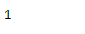

# Python | Pandas Index.ndim

> 原文:[https://www.geeksforgeeks.org/python-pandas-index-ndim/](https://www.geeksforgeeks.org/python-pandas-index-ndim/)

熊猫索引是一个实现有序的、可切片的集合的不可变数组。它是存储所有熊猫对象的轴标签的基本对象。

Pandas `**Index.ndim**`属性返回给定索引对象中底层数据的维数。根据定义，它是 1。

> **语法:** Index.ndim
> 
> **参数:**无
> 
> **返回:**维数

**示例#1:** 使用`Index.ndim`属性找出给定索引对象中底层数据的维数。

```
# importing pandas as pd
import pandas as pd

# Creating the index
idx = pd.Index(['Melbourne', 'Sanghai', 'Lisbon', 'Doha', 'Moscow', 'Rio'])

# Print the index
print(idx)
```

**输出:**


现在我们将使用`Index.ndim`属性找出给定 Index 对象中底层数据的维数。

```
# return the number of dimensions
result = idx.ndim

# Print the result
print(result)
```

**输出:**

正如我们在输出中看到的，`Index.ndim`属性已经返回 1，表示给定 Index 对象中底层数据的维度为 1。

**例 2 :** 使用`Index.ndim`属性找出给定 Index 对象中底层数据的维数。

```
# importing pandas as pd
import pandas as pd

# Creating the index
idx = pd.Index([900 + 3j, 700 + 25j, 620 + 10j, 388 + 44j, 900])

# Print the index
print(idx)
```

**输出:**


现在我们将使用`Index.ndim`属性找出给定 Index 对象中底层数据的维数。

```
# return the number of dimensions
result = idx.ndim

# Print the result
print(result)
```

**输出:**

正如我们在输出中看到的，`Index.ndim`属性已经返回 1，表示给定 Index 对象中底层数据的维度为 1。