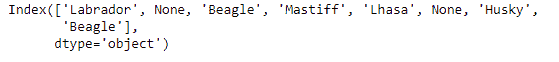
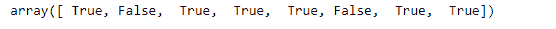
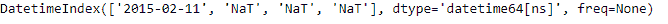
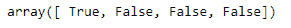

# Python | Pandas index . notna()

> 原文:[https://www.geeksforgeeks.org/python-pandas-index-notna/](https://www.geeksforgeeks.org/python-pandas-index-notna/)

Python 是进行数据分析的优秀语言，主要是因为以数据为中心的 python 包的奇妙生态系统。 ***【熊猫】*** 就是其中一个包，让导入和分析数据变得容易多了。

熊猫 `**Index.notna()**`功能检测现有(非缺失)值。返回一个相同大小的布尔对象，指示值是否为非空。非缺失值映射为真。空字符串”或 numpy.inf 等字符不被视为 NA 值(除非您将 pandas . options . mode . use _ INF _ as _ NA 设置为 True)。数值，如无或数值。NaN，映射到 False 值。

> **语法:** Index.notna()
> 
> **参数:**不取任何参数。
> 
> **返回:** numpy.ndarray:布尔数组，指示哪些条目不是 NA。

**示例#1:** 使用`Index.notna()`函数查找索引中所有未缺失的值。

```
# importing pandas as pd
import pandas as pd

# Creating the Index
idx = pd.Index(['Labrador', None, 'Beagle', 'Mastiff',
                    'Lhasa', None, 'Husky', 'Beagle'])
# Print the Index
idx
```

**输出:**


现在我们检查索引中的非缺失值。

```
# checks for non-missing values.
idx.notna()
```

**输出:**

该函数返回一个与索引大小相同的*数组*对象。`True`值表示索引标签没有丢失，`False`值表示索引标签丢失。

**示例 2:** 使用`Index.notna()`函数检查 Datetime Indexe 中的非缺失标签。

```
# importing pandas as pd
import pandas as pd

# Creating the Datetime Index
idx = pd.DatetimeIndex([pd.Timestamp('2015-02-11'), 
                    None, pd.Timestamp(''), pd.NaT])

# Print the Datetime Index
idx
```

**输出:**


现在，我们将检查 Datetime 索引中的标签是否存在或缺失。

```
# test whether the passed Datetime 
# Index labels are missing or not.
idx.notna()
```

**输出:**


正如我们在输出中看到的，该函数返回了一个数组对象，其大小与 Datetime 索引的大小相同。`True`值表示索引标签没有丢失，`False`值表示索引标签丢失。