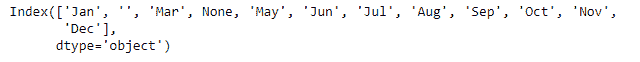
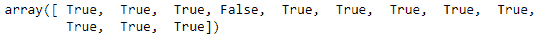
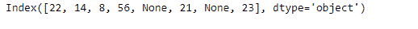
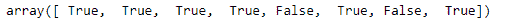

# Python | Pandas index . notnull()

> 原文:[https://www.geeksforgeeks.org/python-pandas-index-notnull/](https://www.geeksforgeeks.org/python-pandas-index-notnull/)

Python 是进行数据分析的优秀语言，主要是因为以数据为中心的 python 包的奇妙生态系统。 ***【熊猫】*** 就是其中一个包，让导入和分析数据变得容易多了。

熊猫 `**Index.notnull()**`功能检测现有(非缺失)值。此函数返回一个相同大小的布尔对象，指示值是否不是 n a。非缺失值映射为真。空字符串”或 numpy.inf 等字符不被视为 NA 值(除非您将 pandas . options . mode . use _ INF _ as _ NA 设置为 True)。数值，如无或数值。NaN，映射到 False 值。

> **语法:** Index.notnull()
> 
> **返回:**布尔数组，表示哪些条目不是 NA。

**示例#1:** 使用`Index.notnull()()`函数检测给定索引中的缺失值。

```
# importing pandas as pd
import pandas as pd

# Creating the index
idx = pd.Index(['Jan', '', 'Mar', None, 'May', 'Jun', 'Jul',
                         'Aug', 'Sep', 'Oct', 'Nov', 'Dec'])

# Print the Index
idx
```

**输出:**


让我们找出索引中所有没有缺失的值

```
# to find the non-missing values.
idx.notnull()
```

**输出:**


正如我们在输出中看到的，所有非缺失值都被映射到`True`，所有缺失值都被映射到`False`。请注意，空字符串已映射到`True`，因为空字符串不被视为缺失值。

**示例 2:** 使用`Index.notnull()`函数找出索引中所有未缺失的值。

```
# importing pandas as pd
import pandas as pd

# Creating the index
idx = pd.Index([22, 14, 8, 56, None, 21, None, 23])

# Print the Index
idx
```

**输出:**


让我们找出索引中所有没有缺失的值

```
# to find the non-missing values.
idx.notnull()
```

**输出:**


正如我们在输出中看到的，所有非缺失值都被映射到`True`，所有缺失值都被映射到`False`。