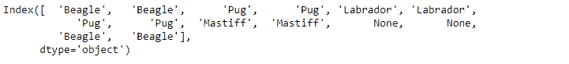
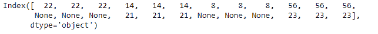

# Python | Pandas index . repeat()

> 原文:[https://www.geeksforgeeks.org/python-pandas-index-repeat/](https://www.geeksforgeeks.org/python-pandas-index-repeat/)

Python 是进行数据分析的优秀语言，主要是因为以数据为中心的 python 包的奇妙生态系统。 ***【熊猫】*** 就是其中一个包，让导入和分析数据变得容易多了。

熊猫 `**Index.repeat()**`功能重复索引的元素。该函数返回一个新的索引，其中当前索引的每个元素被连续重复给定的次数。

> **语法:** Index.repeat(repeats，*args，**kwargs)
> 
> **参数:**
> **重复次数:**每个元素的重复次数。
> ****kwargs :** 额外的关键字没有效果，但为了与 numpy 兼容，可能会被接受。
> 
> **返回:**新创建的包含重复元素的索引。

**示例#1:** 使用`Index.repeat()()`功能重复索引的元素 2 次。

```
# importing pandas as pd
import pandas as pd

# Creating the index
idx = pd.Index(['Beagle', 'Pug', 'Labrador', 'Pug',
                        'Mastiff', None, 'Beagle'])

# Print the Index
idx
```

**输出:**


让我们重复索引元素两次。

```
# to repeat the values
idx.repeat(2)
```

**输出:**

正如我们在输出中看到的，该函数返回了一个新的索引，所有的值重复了 2 次。需要注意的一点是，函数也重复了`NaN`值。

**例 2:** 使用`Index.repeat()`功能重复索引值 3 次。

```
# importing pandas as pd
import pandas as pd

# Creating the index
idx = pd.Index([22, 14, 8, 56, None, 21, None, 23])

# Print the Index
idx
```

**输出:**


让我们重复索引元素 3 次。

```
# to repeat the values
idx.repeat(3)
```

**输出:**


正如我们在输出中看到的，该函数返回了一个新的索引，所有的值重复了 3 次。需要注意的一点是，函数也重复了`NaN`值。