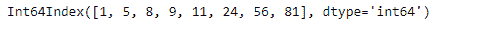
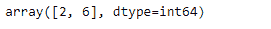

# Python | Pandas index . search sorted()

> 原文:[https://www . geesforgeks . org/python-pandas-index-search sorted/](https://www.geeksforgeeks.org/python-pandas-index-searchsorted/)

Python 是进行数据分析的优秀语言，主要是因为以数据为中心的 python 包的奇妙生态系统。 ***【熊猫】*** 就是其中一个包，让导入和分析数据变得容易多了。

熊猫 `**Index.searchsorted()**`函数找到元素应该插入的索引，以维持秩序。该函数将索引查找到已排序的 IndexOpsMixin self 中，这样，如果在索引之前插入了相应的值元素，则 self 的顺序将被保留。

> **语法:** Index.searchsorted(值，边= '左'，排序器=无)
> 
> **参数:**
> **值:**值插入自我。
> **边:**如果‘左’，给出找到的第一个合适位置的索引。如果“正确”，返回最后一个这样的索引。如果没有合适的索引，返回 0 或 N(其中 N 是自身的长度)。
> **排序器:**可选整数索引数组，将自身按升序排序。它们通常是 np.argsort 的结果。
> 
> **返回:**【索引:整数数组】与值形状相同的插入点数组。

**示例#1:** 使用`Index.searchsorted()`函数找到插入元素的正确位置，以便索引保持排序。

```
# importing pandas as pd
import pandas as pd

# Creating the index
idx = pd.Index([1, 5, 8, 9, 11, 24, 56, 81])

# Print the Index
idx
```

**输出:**


如果要插入的元素是 10，让我们找到要插入的的位置

```
# to find the position of inseretion
idx.searchsorted(10)
```

**输出:**

正如我们在输出中看到的，函数返回了 4，表示如果要维持顺序，在索引中插入 10 的正确位置是 4。

**示例 2:** 使用`Index.searchsorted()`函数为索引中的多个元素找到正确的插入位置。插入时应保持顺序。

```
# importing pandas as pd
import pandas as pd

# Creating the index
idx = pd.Index([1, 5, 8, 9, 11, 24, 56, 81])

# Print the Index
idx
```

**输出:**


如果要插入的元素是 7 和 29，让我们找到要插入的的位置

```
# to find the position of inseretion
idx.searchsorted([7, 29])
```

**输出:**

正如我们在输出中看到的，函数返回了 2 和 6，表示如果要维持顺序，在索引中插入 7 和 29 的正确位置是第 2 和第 6 位。