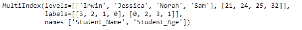

# Python | Pandas index . set _ name()

> 原文:[https://www . geesforgeks . org/python-pandas-index-set _ names/](https://www.geeksforgeeks.org/python-pandas-index-set_names/)

Python 是进行数据分析的优秀语言，主要是因为以数据为中心的 python 包的奇妙生态系统。 ***【熊猫】*** 就是其中一个包，让导入和分析数据变得容易多了。

熊猫 `**Index.set_names()**`功能在索引上设置新名字。对于给定的索引，它会重置该索引的名称属性。它默认返回新索引。这些函数还可以用来重置多索引的名称属性。

> **语法:**index . set _ name(名称，级别=无，位置=假)
> 
> **参数:**
> **名称:**【字符串或序列】名称设置
> **级别:**如果索引是多索引(分层)，级别设置(所有级别均为无)。否则等级必须为无
> **在原地:**【布尔】如果为真，在原地变异
> 
> **返回:**新索引(相同类型和类…等)【如果在原地，返回无】

**示例#1:** 使用`Index.set_names()`函数创建一个匿名索引，并使用名称参数设置其名称。

```
# importing pandas as pd
import pandas as pd

# Creating the index and setting the name
pd.Index(['Beagle', 'Pug', 'Labrador', 'Pug',
   'Mastiff', None, 'Beagle']).set_names('Dog_breeds')
```

**输出:**

正如我们在输出中看到的，函数已经重置了匿名索引的名称属性。

**示例 2:** 使用`Index.set_names()`功能重置多索引的名称属性。

```
# importing pandas as pd
import pandas as pd

# Creating the multi-index form tuples
midx = pd.MultiIndex.from_tuples([('Sam', 21), ('Norah', 25), ('Jessica', 32),
                                       ('Irwin', 24)], names =['Name', 'Age'])

# Print the Multi-Index
midx
```

**输出:**

在输出中我们可以看到，midx 多索引的名称属性设置为‘Name’和‘Age’。让我们将这些名字重新设置为“学生姓名”和“学生年龄”

```
# to reset the name of the midx
midx.set_names(['Student_Name', 'Student_Age'])
```

**输出:**

在输出中我们可以看到，该函数已经重置了 *midx* 多索引的名称属性。