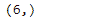

# 蟒蛇|熊猫索引.形状

> 原文:[https://www.geeksforgeeks.org/python-pandas-index-shape/](https://www.geeksforgeeks.org/python-pandas-index-shape/)

熊猫索引是一个实现有序的、可切片的集合的不可变数组。它是存储所有熊猫对象的轴标签的基本对象。

熊猫 `**Index.shape**`属性返回给定索引对象中基础数据形状的元组。

> **语法:**索引.形状
> 
> **参数:**无
> 
> **返回:**元组

**示例#1:** 使用`Index.shape`属性返回给定索引对象中基础数据形状的元组。

```py
# importing pandas as pd
import pandas as pd

# Creating the index
idx = pd.Index(['Melbourne', 'Sanghai', 'Lisbon', 'Doha', 'Moscow', 'Rio'])

# Print the index
print(idx)
```

**输出:**


现在我们将使用`Index.shape`属性返回给定 Index 对象中基础数据形状的元组。

```py
# return a tuple of the shape
# of data in idx object
result = idx.shape

# Print the result
print(result)
```

**输出:**


正如我们在输出中看到的那样，`Index.shape`属性根据给定 Index 对象中底层数据的大小返回了一个元组。

**示例 2 :** 使用`Index.shape`属性返回给定索引对象中基础数据形状的元组。

```py
# importing pandas as pd
import pandas as pd

# Creating the index
idx = pd.Index([900 + 3j, 700 + 25j, 620 + 10j, 388 + 44j, 900])

# Print the index
print(idx)
```

**输出:**


现在我们将使用`Index.shape`属性返回给定 Index 对象中基础数据形状的元组。

```py
# return a tuple of the shape
# of data in idx object
result = idx.shape

# Print the result
print(result)
```

**输出:**

正如我们在输出中看到的，`Index.shape`属性已经根据给定 Index 对象中底层数据的大小返回了一个元组。