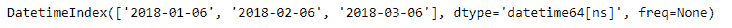

# Python | Pandas index . shift()

> 原文:[https://www.geeksforgeeks.org/python-pandas-index-shift/](https://www.geeksforgeeks.org/python-pandas-index-shift/)

Python 是进行数据分析的优秀语言，主要是因为以数据为中心的 python 包的奇妙生态系统。 ***【熊猫】*** 就是其中一个包，让导入和分析数据变得容易多了。

熊猫 `**Index.shift()**`功能按所需的时间频率增量移动指数。此方法用于将类似日期时间的索引值移动指定的时间增量给定的次数。此方法仅适用于类似日期时间的索引类，即日期时间索引、周期索引和时间增量索引。

> **语法:**索引.移位(周期=1，频率=无)
> 
> **参数:**
> **周期:**周期数(或增量)可以是正的或负的。
> **freq :** 【熊猫。日期偏移，熊猫。时间增量或字符串，可选]要移位的频率增量。如果为“无”，则索引通过其自身的 freq 属性进行移动。偏移别名是有效的字符串，例如“D”、“W”、“M”等
> 
> **返回:**移位索引

**示例#1:** 使用`Index.shift()`功能将时间序列数据移动一定的持续时间。

```py
# importing pandas as pd
import pandas as pd

# Creating the index 
idx = pd.date_range('1 / 1/2018', periods = 3, freq ='MS')

# Print the index
idx
```

**输出:**


现在我们将指数移动 5 天。

```py
# shifting the index by 5 days
idx.shift(5, freq ='D')
```

**输出:**

正如我们在输出中看到的，日期已经向前移动了 5 天。

**示例 2:** 使用`Index.shift()`功能移动基于日期时间的索引。

```py
# importing pandas as pd
import pandas as pd

# Creating the index 
idx = pd.date_range('1 / 1/2018', periods = 3, freq ='MS')

# Print the index
idx
```

**输出:**


现在我们将把指数移动 5 个月。

```py
# shifting the index by 5 Months
idx.shift(5, freq ='MS')
```

**输出:**

在输出中我们可以看到，日期已经向前移动了 5 个月。