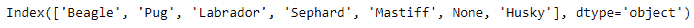
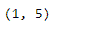
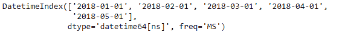
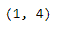

# Python | Pandas index . slice _ locs()

> 原文:[https://www . geesforgeks . org/python-pandas-index-slice _ locs/](https://www.geeksforgeeks.org/python-pandas-index-slice_locs/)

Python 是进行数据分析的优秀语言，主要是因为以数据为中心的 python 包的奇妙生态系统。 ***【熊猫】*** 就是其中一个包，让导入和分析数据变得容易多了。

熊猫 `**Index.slice_locs()**`功能计算输入标签的切片位置。它将开始和结束标签作为参数，并返回与这些值对应的整数值。

> **语法:**index . slice _ locas(开始=无，结束=无，步骤=无，种类=无)
> 
> **参数:**
> **开始:**如果无，默认为开始
> **结束:**如果无，默认为结束
> **步骤:**如果无，默认为 1
> **种类:** {'ix '，' loc '，' getitem'}或无
> 
> **返回:**开始，结束:int

**示例#1:** 使用`Index.slice_locs()`功能查找输入值的切片标签。

```
# importing pandas as pd
import pandas as pd

# Creating the index 
idx = pd.Index(['Beagle', 'Pug', 'Labrador', 'Sephard',
                             'Mastiff', None, 'Husky'])

# Print the index
idx
```

**输出:**


现在我们将找到“哈巴狗”和“獒犬”的切片标签

```
# finding the slice labels for the input value.
idx.slice_locs(start ='Pug', end ='Mastiff')
```

**输出:**

正如我们在输出中看到的，该函数已经返回了输入标签的切片位置。

**示例#2:** 使用`Index.slice_locs()`函数在日期时间基准索引中查找切片标签。

```
# importing pandas as pd
import pandas as pd

# Creating the index 
idx = pd.date_range('1 / 1/2018', periods = 5, freq ='MS')

# Print the index
idx
```

**输出:**


现在，我们将找到输入标签的切片标签。

```
# finding the slice labels
idx.slice_locs(start ='2018-02-01', end ='2018-04-01')
```

**输出:**

正如我们在输出中看到的，函数返回了包含输入切片标签值的范围值。