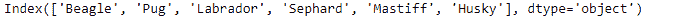
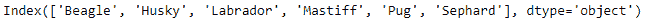
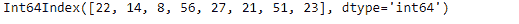
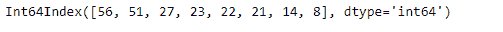

# Python | Pandas index . sort _ values()

> 原文:[https://www . geesforgeks . org/python-pandas-index-sort _ values/](https://www.geeksforgeeks.org/python-pandas-index-sort_values/)

Python 是进行数据分析的优秀语言，主要是因为以数据为中心的 python 包的奇妙生态系统。 ***【熊猫】*** 就是其中一个包，让导入和分析数据变得容易多了。

熊猫 `**Index.sort_values()**`功能用于对索引值进行排序。函数返回索引的排序副本。除了对数值进行排序之外，该函数还可以对字符串类型的值进行排序。

> **语法:**index . sort _ values(return _ indexer = False，升序=True)
> 
> **参数:**
> **return_indexer :** 应该返回对索引进行排序的索引。
> **升序:**索引值应该按升序排序。
> 
> **返回:**索引的排序副本。
> **整理 _ 索引:**熊猫。索引
> 
> **索引器:** numpy.ndarray，可选
> 索引本身排序所依据的索引。

**示例#1:** 使用`Index.sort_values()`函数对索引中的值进行排序。

```py
# importing pandas as pd
import pandas as pd

# Creating the index 
idx = pd.Index(['Beagle', 'Pug', 'Labrador',
             'Sephard', 'Mastiff', 'Husky'])

# Print the index
idx
```

**输出:**


现在我们将按升序对索引标签进行排序。

```py
# Sorting the index labels
idx.sort_values(ascending = True)
```

**输出:**

正如我们在输出中看到的，该函数返回了一个标签已排序的索引。

**例 2:** 使用`Index.sort_values()`功能对索引标签进行降序排序。

```py
# importing pandas as pd
import pandas as pd

# Creating the index 
idx = pd.Index([22, 14, 8, 56, 27, 21, 51, 23])

# Print the index
idx
```

**输出:**


现在我们将按非递增顺序对索引标签进行排序。

```py
# sort the values in descending order
idx.sort_values(ascending = False)
```

**输出:**

正如我们在输出中看到的，函数返回了一个新的索引，其标签按降序排序。