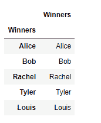
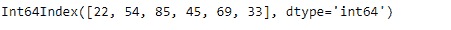
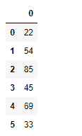

# Python | Pandas index . to _ frame()

> 原文:[https://www.geeksforgeeks.org/python-pandas-index-to_frame/](https://www.geeksforgeeks.org/python-pandas-index-to_frame/)

Python 是进行数据分析的优秀语言，主要是因为以数据为中心的 python 包的奇妙生态系统。 ***【熊猫】*** 就是其中一个包，让导入和分析数据变得容易多了。

熊猫 `**Index.to_frame()**`函数从给定的索引创建一个数据帧，其中一列包含索引。默认情况下，原始索引在新数据帧中重复使用。为了加强新创建的数据框的新索引，我们将函数的索引参数设置为 false。

> **语法:** Index.to_frame(index=True)
> 
> **参数:**
> **索引:**将返回的数据帧的索引设置为原始索引。
> 
> **返回:**包含原始索引数据的数据帧。

**示例#1:** 使用`Index.to_frame()`函数将索引转换为数据帧。

```py
# importing pandas as pd
import pandas as pd

# Creating the index
idx = pd.Index(['Alice', 'Bob', 'Rachel', 'Tyler',
                        'Louis'], name ='Winners')

# Print the Index
idx
```

**输出:**


让我们把索引转换成数据帧。

```py
# convert the index into a dataframe
idx.to_frame()
```

**输出:**

该函数已将索引转换为数据帧。默认情况下，该函数使用原始索引的值创建了数据框的索引。

**示例#2:** 使用`Index.to_frame()`函数将索引转换为数据帧，以便创建的数据帧使用新的索引值。

```py
# importing pandas as pd
import pandas as pd

# Creating the index
idx = pd.Index([22, 54, 85, 45, 69, 33])

# Print the Index
idx
```

**输出:**


让我们把索引转换成数据帧。

```py
# convert the index into a dataframe
idx.to_frame(index = False)
```

**输出:**
