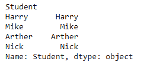
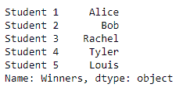

# Python | Pandas index . to _ series()

> 原文:[https://www . geesforgeks . org/python-pandas-index-to _ series/](https://www.geeksforgeeks.org/python-pandas-index-to_series/)

Python 是进行数据分析的优秀语言，主要是因为以数据为中心的 python 包的奇妙生态系统。 ***【熊猫】*** 就是其中一个包，让导入和分析数据变得容易多了。

熊猫 `**Index.to_series()**`函数创建一个系列，其索引和值等于索引键，可用于映射，以返回基于索引的索引器。通过传递新索引标签列表，可以为新创建的系列设置新索引标签。

> **语法:** Index.to_series(index=None，name=None)
> 
> **参数:**
> **指数:**所得系列指数。如果无，默认为原始索引
> **名称:**结果系列的名称。如果为无，则默认为原始索引的名称
> 
> **返回:**系列:数据类型将基于索引值的类型。

**示例#1:** 使用`Index.to_series()`函数将索引转换为序列。

```py
# importing pandas as pd
import pandas as pd

# Creating the index
idx = pd.Index(['Harry', 'Mike', 'Arther', 'Nick'],
                                   name ='Student')

# Print the Index
print(idx)
```

**输出:**


让我们把索引转换成数列。

```py
# convert the index into a series
idx.to_series()
```

**输出:**

该函数已将指数转换为系列。默认情况下，该函数使用原始索引的值创建了序列的索引。

**示例#2:** 使用`Index.to_series()`函数将索引转换为系列，以便创建的系列使用新的索引值。

```py
# importing pandas as pd
import pandas as pd

# Creating the index
idx = pd.Index(['Alice', 'Bob', 'Rachel', 'Tyler', 'Louis'],
                                            name ='Winners')

# Print the Index
print(idx)
```

**输出:**


让我们把索引转换成数列。

```py
# convert the index into a series
idx.to_series(index =['Student 1', 'Student 2', 'Student 3',
                                  'Student 4', 'Student 5'])
```

**输出:**

该函数已经将指数转换为一个序列。我们已经传递了一个用于新创建的系列的索引标签列表。