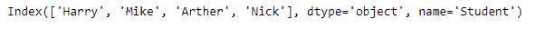
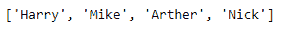
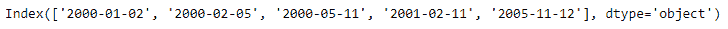
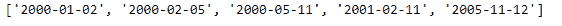

# Python | Pandas index . tolist()

> 原文:[https://www.geeksforgeeks.org/python-pandas-index-tolist/](https://www.geeksforgeeks.org/python-pandas-index-tolist/)

Python 是进行数据分析的优秀语言，主要是因为以数据为中心的 python 包的奇妙生态系统。 ***【熊猫】*** 就是其中一个包，让导入和分析数据变得容易多了。

熊猫 `**Index.tolist()**`函数返回一个值列表。这些都是标量类型，它是 Python 标量(用于字符串、整型、浮点型)或 pandas 标量(用于时间戳/时间增量/间隔/周期)。

> **语法:** Index.tolist()
> 
> **参数:**无
> 
> **返回:**列表

**示例#1:** 使用`Index.tolist()`函数将索引转换为列表。

```py
# importing pandas as pd
import pandas as pd

# Creating the index
idx = pd.Index(['Harry', 'Mike', 'Arther', 'Nick'],
                                  name ='Student')

# Print the Index
print(idx)
```

**输出:**


让我们将索引转换为列表。

```py
# convert the index into a list
idx.tolist()
```

**输出:**


**示例 2:** 使用`Index.tolist()`函数将索引转换为 python 列表。

```py
# importing pandas as pd
import pandas as pd

# Creating the index
idx = pd.Index(['2000-01-02', '2000-02-05', '2000-05-11',
                            '2001-02-11', '2005-11-12'])

# Print the Index
print(idx)
```

**输出:**


让我们将索引转换为列表。

```py
# convert the index into a list
idx.tolist()
```

**输出:**
