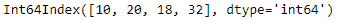
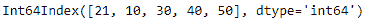
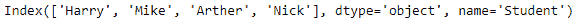
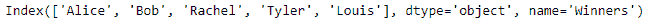
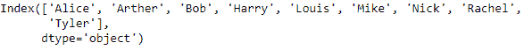

# Python | Pandas index . union()

> 原文:[https://www.geeksforgeeks.org/python-pandas-index-union/](https://www.geeksforgeeks.org/python-pandas-index-union/)

Python 是进行数据分析的优秀语言，主要是因为以数据为中心的 python 包的奇妙生态系统。 ***【熊猫】*** 就是其中一个包，让导入和分析数据变得容易多了。

熊猫 **Index.union()** 函数形成两个 Index 对象的并集，并在可能的情况下进行排序。下面的函数的行为类似于标准的集合并运算。该函数还可以找到分类数据的并集。

> **语法:** Index.union(other)
> **参数:**
> **other :** Index 或类似数组的
> **返回:** union : Index

**例#1:** 用 Index.union()函数求两个索引的并集。

## 蟒蛇 3

```
# importing pandas as pd
import pandas as pd

# Creating the first index
idx1 = pd.Index([10, 20, 18, 32])

# Creating the second index
idx2 = pd.Index([21, 10, 30, 40, 50])

# Print the first Index
print(idx1)

# Print the second Index
print("\n", idx2)
```

**输出:**

 

让我们找到这两个索引的并集

## 蟒蛇 3

```
# perform set union of the two indexes
idx1.union(idx2)
```

**输出:**


函数找到了这两个索引的并集。

**示例 2:** 使用 Index.union()函数对给定的两个索引执行 set union 操作。索引标签是字符串类型的。

## 蟒蛇 3

```
# importing pandas as pd
import pandas as pd

# Creating the first index
idx1 = pd.Index(['Harry', 'Mike', 'Arther', 'Nick'],
                                    name ='Student')

# Creating the second index
idx2 = pd.Index(['Alice', 'Bob', 'Rachel', 'Tyler', 'Louis'],
                                            name ='Winners')

# Print the first Index
print(idx1)

# Print the second Index
print("\n", idx2)
```

**输出:**

 

让我们找到这两个索引的并集。

## 蟒蛇 3

```
# find union of two indexes
idx1.union(idx2)
```

**输出:**



该函数返回了一个新的索引，其中包含 idx1 和 idx2 的集合并集的结果。