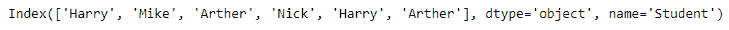
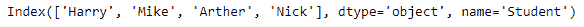

# 蟒蛇|熊猫索引. unique()

> 原文:[https://www.geeksforgeeks.org/python-pandas-index-unique/](https://www.geeksforgeeks.org/python-pandas-index-unique/)

Python 是进行数据分析的优秀语言，主要是因为以数据为中心的 python 包的奇妙生态系统。 ***【熊猫】*** 就是其中一个包，让导入和分析数据变得容易多了。

熊猫 `**Index.unique()**`函数返回索引中的唯一值。Uniques 按外观顺序返回，这不排序。

> **语法:**索引。唯一(级别=无)
> 
> **参数:**
> **级别:**仅返回指定级别的值(对于多索引)
> 
> **返回:**无重复的索引

**示例#1:** 使用`Index.unique()`函数返回索引中的唯一值。

```
# importing pandas as pd
import pandas as pd

# Creating the index
idx = pd.Index(['Harry', 'Mike', 'Arther', 'Nick',
                'Harry', 'Arther'], name ='Student')

# Print the Index
print(idx)
```

**输出:**


让我们找到索引中所有唯一的值。

```
# find unique values in the index
idx.unique()
```

**输出:**

该函数返回了一个新的索引，该索引具有原始索引的所有唯一值。

**示例 2:** 使用`Index.unique()`函数查找索引中的唯一值

```
# importing pandas as pd
import pandas as pd

# Creating the index
idx = pd.Index([21, 10, 30, 40, 50, 10, 50])

# Print the Index
print(idx)
```

**输出:**


让我们找到索引中所有唯一的值

```
# for finding the unique values in the index
idx.unique()
```

**输出:**

该函数返回了一个新的索引，该索引包含了原始索引中的所有唯一值。