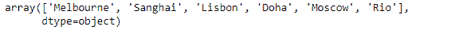
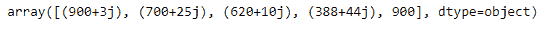

# 蟒蛇|熊猫指数数值

> 原文:[https://www.geeksforgeeks.org/python-pandas-index-values/](https://www.geeksforgeeks.org/python-pandas-index-values/)

熊猫索引是一个实现有序的、可切片的集合的不可变数组。它是存储所有熊猫对象的轴标签的基本对象。

熊猫 `**Index.values**`属性返回一个数组，表示给定索引对象中的数据。

> **语法:**索引.值
> 
> **参数:**无
> 
> **返回:**数组

**示例#1:** 使用`Index.values`属性返回表示给定索引对象中数据的数组。

```
# importing pandas as pd
import pandas as pd

# Creating the index
idx = pd.Index(['Melbourne', 'Sanghai', 'Lisbon', 'Doha', 'Moscow', 'Rio'])

# Print the index
print(idx)
```

**输出:**


现在我们将使用`Index.values`属性返回一个数组，该数组表示给定索引对象中的数据。

```
# return an array
result = idx.values

# Print the result
print(result)
```

**输出:**

正如我们在输出中看到的，`Index.values`属性已经成功返回了一个代表给定 Index 对象数据的数组。

**示例#2 :** 使用`Index.values`属性返回一个数组，该数组表示给定索引对象中的数据。

```
# importing pandas as pd
import pandas as pd

# Creating the index
idx = pd.Index([900 + 3j, 700 + 25j, 620 + 10j, 388 + 44j, 900])

# Print the index
print(idx)
```

**输出:**


现在我们将使用`Index.values`属性返回一个数组，该数组表示给定索引对象中的数据。

```
# return an array
result = idx.values

# Print the result
print(result)
```

**输出:**

正如我们在输出中看到的，`Index.values`属性已经成功返回了一个代表给定 Index 对象数据的数组。