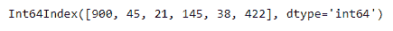
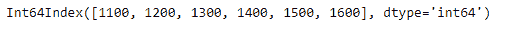
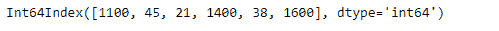
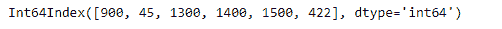

# 蟒蛇|熊猫索引.在哪里

> 原文:[https://www.geeksforgeeks.org/python-pandas-index-where/](https://www.geeksforgeeks.org/python-pandas-index-where/)

熊猫索引是一个实现有序的、可切片的集合的不可变数组。它是存储所有熊猫对象的轴标签的基本对象。

熊猫 `**Index.where**`函数返回一个与自身形状相同的索引，其对应条目来自自身，条件为真，否则来自其他。

> **语法:**索引。其中(秒，其他=无)
> 
> **参数:**
> **条件:**与自身
> **长度相同的布尔数组样:其他:**标量，或数组样
> 
> **返回:**指数

**示例#1:** 使用`Index.where`函数返回一个索引，如果该索引的值不小于 100，我们从另一个索引中选择该值。

```py
# importing pandas as pd
import pandas as pd

# Creating the first index
idx1 = pd.Index([900, 45, 21, 145, 38, 422])

# Creating the second index
idx2 = pd.Index([1100, 1200, 1300, 1400, 1500, 1600])

# Print the first index
print(idx1)

# Print the second index
print(idx2)
```

**输出:**




现在我们将使用`Index.where`函数返回一个索引，其中如果该索引的值不小于 100，我们将从另一个索引中选择该值。

```py
# return the new index based on the condition
result = idx1.where(idx1 < 100, idx2)

# Print the result
print(result)
```

**输出:**

正如我们在输出中看到的，`Index.where`函数已经成功返回了一个满足传递条件的 Index 对象。

**例 2 :** 使用`Index.where`函数返回一个满足传递条件的索引。

```py
# importing pandas as pd
import pandas as pd

# Creating the first index
idx1 = pd.Index([900, 45, 21, 145, 38, 422])

# Creating the second index
idx2 = pd.Index([1100, 1200, 1300, 1400, 1500, 1600])

# Print the first index
print(idx1)

# Print the second index
print(idx2)
```

**输出:**


现在我们将使用`Index.where`函数返回一个 Index，其中如果其他 Index 的值减 1200 不小于 idx1，则从其他 Index 中选择值。

```py
# return the new index based on the condition
result = idx1.where((idx2 - 1200) < idx1, idx2)

# Print the result
print(result)
```

**输出:**

正如我们在输出中看到的，`Index.where`函数已经成功返回了一个满足传递条件的 Index 对象。