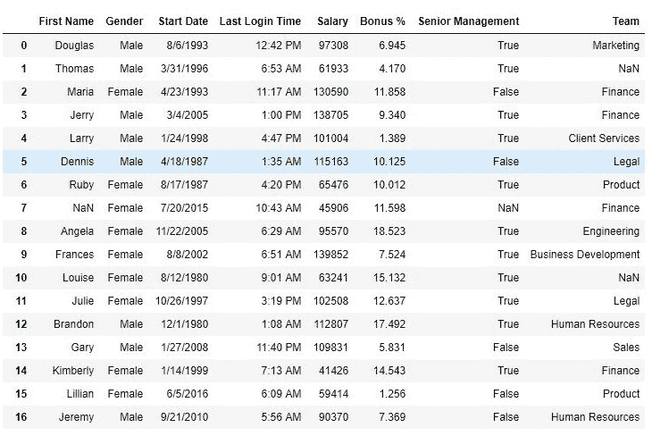

# Python | Pandas 是 null()和 notnull()

> 原文:[https://www . geesforgeks . org/python-pandas-is null-and-not null/](https://www.geeksforgeeks.org/python-pandas-isnull-and-notnull/)

Python 是进行数据分析的优秀语言，主要是因为以数据为中心的 Python 包的奇妙生态系统。 ***【熊猫】*** 就是其中一个包，让导入和分析数据变得容易多了。
从 csv 文件制作数据框时，许多空白列作为空值导入到数据框中，这在以后操作该数据框时会产生问题。Pandas isnull()和 notnull()方法用于检查和管理数据框中的空值。

## Dataframe.isull（）

> **语法:** Pandas.isnull(“数据框名称”)或 DataFrame.isnull()
> **参数:**对象检查
> **的空值返回类型:**对于 NaN 值为真的布尔值的数据框

要下载使用的 CSV 文件，点击[这里](https://media.geeksforgeeks.org/wp-content/uploads/employees.csv)。
**示例#1:** 使用 isnull()
在以下示例中，将检查团队列中的空值，并通过 isnull()方法返回一个布尔序列，该方法为每个 NaN 值存储 True，为非空值存储 False。

## 计算机编程语言

```
# importing pandas package
import pandas as pd

# making data frame from csv file
data = pd.read_csv("employees.csv")

# creating bool series True for NaN values
bool_series = pd.isnull(data["Team"])

# filtering data
# displayind data only with team = NaN
data[bool_series]
```

**输出:**
如输出图像所示，仅显示 Team=NULL 的行。


## dataframe . notnull()

> **语法:** Pandas.notnull(“数据框名称”)或 DataFrame.notnull()
> **参数:**对象检查
> **的空值返回类型:**对 NaN 值为假的布尔值的数据框

**示例#1:** 使用 notnull()
在以下示例中，检查性别列中的空值，并通过 notnull()方法返回一个布尔序列，该方法为非空值存储 True，为空值存储 False。

## 计算机编程语言

```
# importing pandas package
import pandas as pd

# making data frame from csv file
data = pd.read_csv("employees.csv")

# creating bool series False for NaN values
bool_series = pd.notnull(data["Gender"])

# displayed data only with team = NaN
data[bool_series]
```

**输出:**
如输出图像所示，仅显示在性别中具有某些值的行。

