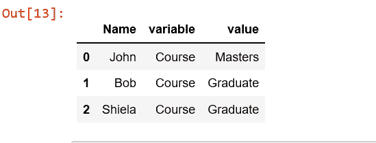
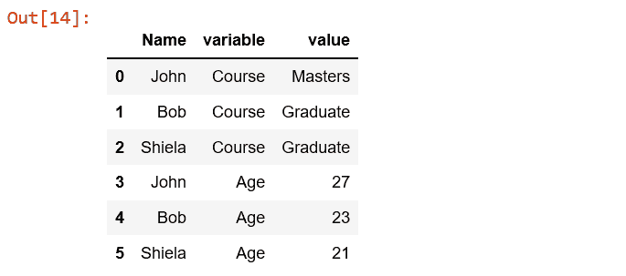
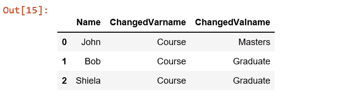

# Python | Pandas.melt()

> 原文:[https://www.geeksforgeeks.org/python-pandas-melt/](https://www.geeksforgeeks.org/python-pandas-melt/)

为了更容易地分析表格中的数据，我们可以使用 Python 中的 Pandas 将数据重塑为更便于计算机使用的形式。Pandas.melt()就是这样做的功能之一..
Pandas.melt()将数据帧从宽格式取消固定为长格式。
**melt()** 函数用于将数据框消息转换为一种格式，其中一列或多列是标识符变量，而所有其他被认为是测量变量的列被取消固定到行轴，只留下两个非标识符列，变量和值。
语法:

```py
pandas.melt(frame, id_vars=None, value_vars=None,
 var_name=None, value_name='value', col_level=None)
```

**参数:**

> **框架:**数据框架
> **id _ vars[元组、列表或数组，可选] :** 用作标识符变量的列。
> **value _ vars[元组、列表或数组，可选]:** 要取消固定的列。如果未指定，将使用所有未设置为 id_vars 的列。
> **var _ Name[标量]:** 用于“变量”列的名称。如果没有，则使用 frame.columns.name 或“variable”。
> **value _ Name[标量，默认‘值’]:**用于‘值’列的名称。
> **col_level[int 或 string，可选]:** 如果列是多索引，则使用该级别进行熔化。

**例:**

## 蟒蛇 3

```py
# Create a simple dataframe

# importing pandas as pd
import pandas as pd

# creating a dataframe
df = pd.DataFrame({'Name': {0: 'John', 1: 'Bob', 2: 'Shiela'},
                   'Course': {0: 'Masters', 1: 'Graduate', 2: 'Graduate'},
                   'Age': {0: 27, 1: 23, 2: 21}})
df
```


## 蟒蛇 3

```py
# Name is id_vars and Course is value_vars
pd.melt(df, id_vars =['Name'], value_vars =['Course'])
```



## 蟒蛇 3

```py
# multiple unpivot columns
pd.melt(df, id_vars =['Name'], value_vars =['Course', 'Age'])
```



## 蟒蛇 3

```py
# Names of ‘variable’ and ‘value’ columns can be customized
pd.melt(df, id_vars =['Name'], value_vars =['Course'],
              var_name ='ChangedVarname', value_name ='ChangedValname')
```

