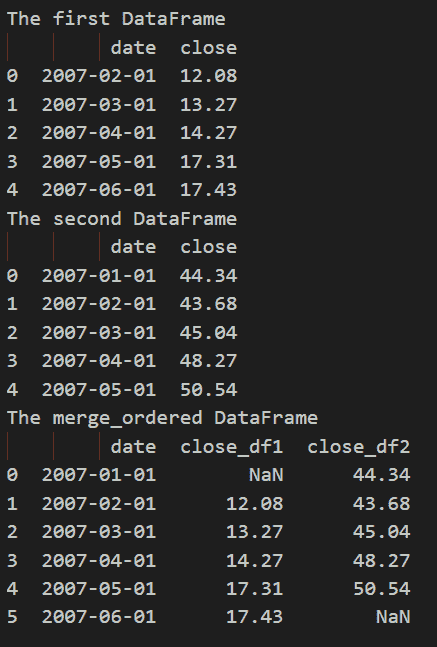
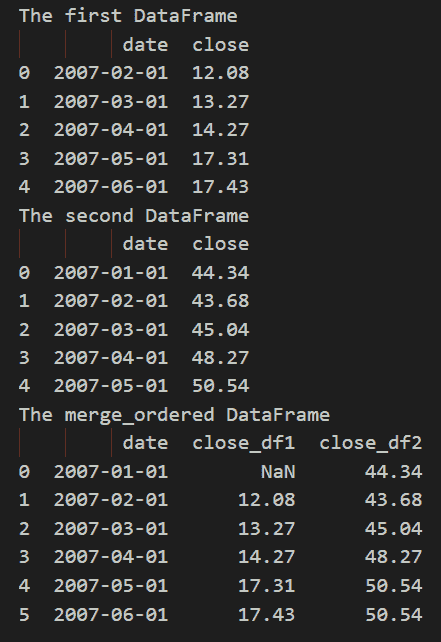
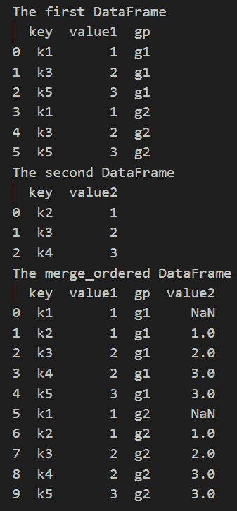

# Python | pandas.merge_ordered()函数

> 原文:[https://www . geesforgeks . org/python-pandas-merge _ ordered-function/](https://www.geeksforgeeks.org/python-pandas-merge_ordered-function/)

这种方法用于设计有序数据，如时间序列数据。可选地执行分组合并**。**

> **语法:** pandas.merge_ordered(左，右，on =无，left _ on =无，right _ on =无，left _ by =无，right _ by =无，fill _ method =无，后缀=('_x '，' _y ')，how='outer')
> **参数:**
> 
> *   **左侧:**数据框
> *   **右侧:**数据框
> *   **在:**标签或列表上
> *   **left_on :** 标签或列表，或类似数组
> *   **right_on :** 标签或列表，或类似数组
> *   **left_by :** 列名或列名列表
> *   **right_by :** 列名或列名列表
> *   **fill_method :** {'ffill '，None}，默认无
> *   **后缀:**列表式，默认为(“_x”，“_y”)
> *   **如何:** { '左'，'右'，'外'，'内' }，默认'外'
> 
> **返回:**一个数据帧，其中合并的数据帧输出类型将与“左”相同，如果它是数据帧的子类。
> T3】

**示例 1 :** 合并具有相同元素数量的有序两个数据帧

## 蟒蛇 3

```
# importing the module
import pandas as pd

# creating the first DataFrame
df1 = pd.DataFrame({
    "date": ['2007-02-01', '2007-03-01', '2007-04-01', '2007-05-01', '2007-06-01'],
    "close": [12.08, 13.27, 14.27, 17.31, 17.43]
})
print("The first DataFrame")
print(df1)

# creating the second DataFrame
df2 = pd.DataFrame({
    "date": ['2007-01-01', '2007-02-01', '2007-03-01', '2007-04-01', '2007-05-01'],
    "close": [44.34, 43.68, 45.04, 48.27, 50.54]
})
print("The second DataFrame")
print(df2)

# merging the DataFrames
print("The merge_ordered DataFrame")

df = pd.merge_ordered(df1, df2, on='date', suffixes=('_df1', '_df2'))

print(df)
# This code is contributed by rakeshsahni
```

**输出:**

<center>
</center>

**示例 2 :** 用之前的值填充缺失的部分，我们使用 fill_method = 'ffill '(向前填充)

## 蟒蛇 3

```
# importing the module
import pandas as pd

# creating the first DataFrame
df1 = pd.DataFrame({
    "date": ['2007-02-01', '2007-03-01', '2007-04-01', '2007-05-01', '2007-06-01'],
    "close": [12.08, 13.27, 14.27, 17.31, 17.43]
})
print("The first DataFrame")
print(df1)

# creating the second DataFrame
df2 = pd.DataFrame({
    "date": ['2007-01-01', '2007-02-01', '2007-03-01', '2007-04-01', '2007-05-01'],
    "close": [44.34, 43.68, 45.04, 48.27, 50.54]
})
print("The second DataFrame")
print(df2)

# merging the DataFrames
print("The merge_ordered DataFrame")

df = pd.merge_ordered(df1, df2, on='date', suffixes=(
    '_df1', '_df2'), fill_method='ffill')

print(df)
# This code is contributed by rakeshsahni
```

**输出:**

<center>
</center>

**示例 3 :** 我们将使用 left_by 参数，该参数将左侧数据框按组列分组，并与右侧数据框逐块合并。

## 蟒蛇 3

```
# importing the module
import pandas as pd

# creating the first DataFrame
df1 = pd.DataFrame(
    {
        "key": ["k1", "k3", "k5", "k1", "k3", "k5"],
        "value1": [1, 2, 3, 1, 2, 3],
        "gp": ["g1", "g1", "g1", "g2", "g2", "g2"]
    }
)
df1
print("The first DataFrame")
print(df1)

# creating the second DataFrame
df2 = pd.DataFrame({"key": ["k2", "k3", "k4"], "value2": [1, 2, 3]})

print("The second DataFrame")
print(df2)

# merging the DataFrames
print("The merge_ordered DataFrame")

df = pd.merge_ordered(df1,df2,fill_method='ffill',left_by="gp")

print(df)
# This code is contributed by rakeshsahni
```

**输出:**

<center>

</center>