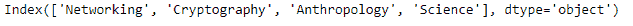

# Python | Pandas multi index . drop level()

> 原文:[https://www . geesforgeks . org/python-pandas-multi index-drop level/](https://www.geeksforgeeks.org/python-pandas-multiindex-droplevel/)

Python 是进行数据分析的优秀语言，主要是因为以数据为中心的 python 包的奇妙生态系统。 ***【熊猫】*** 就是其中一个包，让导入和分析数据变得容易多了。

熊猫 `**MultiIndex.droplevel()**`功能返回已移除请求级别的索引。如果多索引只有两个级别，结果将是索引类型而不是多索引..

> **语法:**multi index . drop level(level = 0)
> 
> **参数:**
> **等级:**int/等级名称或其列表
> 
> **返回:**索引:索引或多索引

**示例#1:** 使用`MultiIndex.droplevel()`功能删除多索引的第 0 级。

```
# importing pandas as pd
import pandas as pd

# Create the MultiIndex
midx = pd.MultiIndex.from_arrays([['Networking', 'Cryptography', 
                                     'Anthropology', 'Science'], 
                                             [88, 84, 98, 95]])

# Print the MultiIndex
print(midx)
```

**输出:**


现在让我们放下多索引的第 0 级。

```
# drop the 0th level.
midx.droplevel(level = 0)
```

**输出:**

正如我们在输出中看到的，该函数已经下降了第 0 级并返回了一个 Index 对象。

**示例 2:** 使用`MultiIndex.droplevel()`功能放下多索引的第一级。

```
# importing pandas as pd
import pandas as pd

# Create the MultiIndex
midx = pd.MultiIndex.from_arrays([['Networking', 'Cryptography',
                                     'Anthropology', 'Science'],
                                              [88, 84, 98, 95]])

# Print the MultiIndex
print(midx)
```

**输出:**


现在让我们放下多索引的第一级。

```
# drop the 1st level.
midx.droplevel(level = 1)
```

**输出:**

正如我们在输出中看到的，函数已经下降了第 1 级，返回了一个 Index 对象。