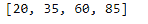
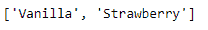
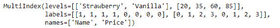
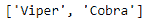
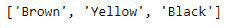
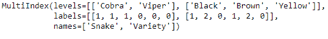

# Python | Pandas multi index . from _ product()

> 原文:[https://www . geesforgeks . org/python-pandas-multi index-from _ product/](https://www.geeksforgeeks.org/python-pandas-multiindex-from_product/)

Python 是进行数据分析的优秀语言，主要是因为以数据为中心的 python 包的奇妙生态系统。 ***【熊猫】*** 就是其中一个包，让导入和分析数据变得容易多了。

熊猫 `**MultiIndex.from_product()**`函数根据多个数据项的笛卡儿积生成一个多索引。

> **语法:**multi index . from _ product(iterables，sortorder=None，names = None)
> 
> **参数:**
> **可重复项:**每个可重复项对于索引的每个级别都有唯一的标签。
> **排序顺序:**排序级别(必须按该级别按字典顺序排序)。
> **名称:**索引中级别的名称。
> 
> **返回:**索引:多索引

**示例#1:** 使用`MultiIndex.from_product()`函数从多个项的笛卡儿积构建多索引。

```
# importing pandas as pd
import pandas as pd

# Create the first iterable
Price =[20, 35, 60, 85]

# Create the second iterable
Name =['Vanilla', 'Strawberry']

# Print the first iterable
print(Price)

# Print the second iterable
print("\n", Name)
```

**输出:**
 

现在让我们使用上面的两个表来创建 MultiIndex。

```
# Creating the MultiIndex
midx = pd.MultiIndex.from_product([Name, Price],
                       names =['Name', 'Price'])

# Print the MultiIndex
print(midx)
```

**输出:**

正如我们在输出中看到的，该函数已经使用这两个可选项的笛卡尔乘积创建了一个 MultiIndex 对象。

**示例#2:** 使用`MultiIndex.from_product()`函数从多个项的笛卡儿积构建多索引。

```
# importing pandas as pd
import pandas as pd

# Create the first iterable
Snake =['Viper', 'Cobra']

# Create the second iterable
Variety =['Brown', 'Yellow', 'Black']

# Print the first iterable
print(Snake)

# Print the second iterable
print("\n", Variety)
```

**输出:**
 

现在让我们使用上面的两个表来创建 MultiIndex。

```
# Creating the MultiIndex
midx = pd.MultiIndex.from_product([Snake, Variety], 
                       names =['Snake', 'Variety'])

# Print the MultiIndex
print(midx)
```

**输出:**

该函数使用两个可选项创建了一个多索引。