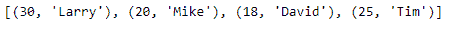
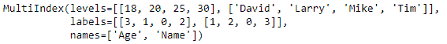
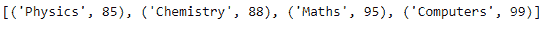
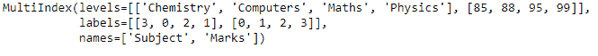

# Python | Pandas multi index . from _ tuples()

> 原文:[https://www . geesforgeks . org/python-pandas-multi index-from _ tuples/](https://www.geeksforgeeks.org/python-pandas-multiindex-from_tuples/)

Python 是进行数据分析的优秀语言，主要是因为以数据为中心的 python 包的奇妙生态系统。 ***【熊猫】*** 就是其中一个包，让导入和分析数据变得容易多了。

熊猫 `**MultiIndex.from_tuples()**`函数用于将元组列表转换为多索引。这是我们构建多索引的几种方法之一。

> **语法:**multi index . from _ 元组(元组，排序顺序=无，名称=无)
> 
> **参数:**
> **元组:**每个元组是一行/一列的索引。
> **排序顺序:**排序级别(必须按该级别按字典顺序排序)
> 
> **返回:**索引:多索引

**示例#1:** 使用`MultiIndex.from_tuples()`函数使用 python 元组构建多索引。

```py
# importing pandas as pd
import pandas as pd

# Creating the Tuple
tuples =[(30, 'Larry'), (20, 'Mike'),
         (18, 'David'), (25, 'Tim')]

# Print the Tuple
print(tuples)
```

**输出:**


现在让我们使用元组创建多索引。

```py
# Creating the MultiIndex
midx = pd.MultiIndex.from_tuples(tuples, names =('Age', 'Name'))

# Print the MultiIndex
print(midx)
```

**输出:**

正如我们在输出中看到的，该函数已经使用元组创建了一个 MultiIndex 对象。

**示例#2:** 使用`MultiIndex.from_tuples()`函数使用 python 元组构建 MultiIndex。

```py
# importing pandas as pd
import pandas as pd

# Creating the Tuple
tuples =[('Physics', 85), ('Chemistry', 88),
           ('Maths', 95), ('Computers', 99)]

# Print the Tuple
print(tuples)
```

**输出:**


现在让我们使用元组创建多索引。

```py
# Creating the MultiIndex
midx = pd.MultiIndex.from_tuples(tuples, names =('Subject', 'Marks'))

# Print the MultiIndex
print(midx)
```

**输出:**
