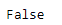
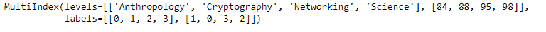

# Python | Pandas multi index . is _ lexsorted()

> 原文:[https://www . geesforgeks . org/python-pandas-multi index-is _ lexsorted/](https://www.geeksforgeeks.org/python-pandas-multiindex-is_lexsorted/)

Python 是进行数据分析的优秀语言，主要是因为以数据为中心的 python 包的奇妙生态系统。 ***【熊猫】*** 就是其中一个包，让导入和分析数据变得容易多了。

如果标签是按字典顺序排序的，熊猫 `**MultiIndex.is_lexsorted()**`函数返回`True`。否则，函数返回`False`，表示标签没有按字典顺序排序。

> **语法:** MultiIndex.is_lexsorted()
> 
> **参数:**无
> 
> **返回:**布尔值

**示例#1:** 使用`MultiIndex.is_lexsorted()`功能检查多索引标签是否按字典顺序排序。

```py
# importing pandas as pd
import pandas as pd

# Create the MultiIndex
midx = pd.MultiIndex.from_arrays([['Networking', 'Cryptography',
                                     'Anthropology', 'Science'], 
                                             [88, 84, 98, 95]])

# Print the MultiIndex
print(midx)
```

**输出:**


现在让我们检查一下多索引中的标签是否按字典顺序排序。

```py
# check if labels are sorted or not
midx.is_lexsorted()
```

**输出:**

正如我们在输出中看到的，函数返回了 false，表示 MultiIndex 中的标签没有按字典顺序排序。

**示例 2:** 使用`MultiIndex.is_lexsorted()`功能检查多索引标签是否按字典顺序排序。

```py
# importing pandas as pd
import pandas as pd

# Create the MultiIndex
midx = pd.MultiIndex.from_arrays([['Anthropology', 'Cryptography', 
                                         'Networking', 'Science'], 
                                               [88, 84, 98, 95]])

# Print the MultiIndex
print(midx)
```

**输出:**


现在让我们检查一下多索引中的标签是否按字典顺序排序。

```py
# check if labels are sorted or not
midx.is_lexsorted()
```

**输出:**

正如我们在输出中看到的，函数返回 true，表示 MultiIndex 中的标签是按字典顺序排序的。