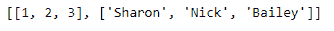
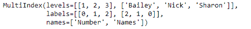
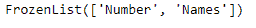
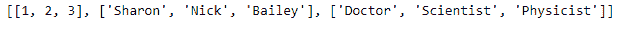
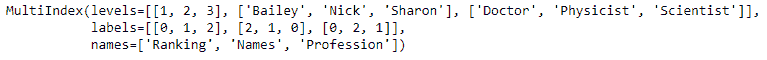
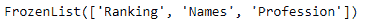

# 蟒蛇|熊猫多索引.名称

> 原文:[https://www . geesforgeks . org/python-pandas-multi index-names/](https://www.geeksforgeeks.org/python-pandas-multiindex-names/)

Python 是进行数据分析的优秀语言，主要是因为以数据为中心的 python 包的奇妙生态系统。 ***【熊猫】*** 就是其中一个包，让导入和分析数据变得容易多了。

熊猫 `**MultiIndex.names**`属性返回多索引中的级别名称。

> **语法:**多索引.名称

**示例#1:** 使用`MultiIndex.names`属性查找多索引中的级别名称。

```
# importing pandas as pd
import pandas as pd

# Creating the array
array = [[1, 2, 3], ['Sharon', 'Nick', 'Bailey']]

# Print the array
print(array)
```

**输出:**


现在让我们使用这个数组创建多索引

```
# Creating the MultiIndex
midx = pd.MultiIndex.from_arrays(array, names =('Number', 'Names'))

# Print the MultiIndex
print(midx)
```

**输出:**


现在我们将在多索引中找到所有级别的名称。

```
# Print the names of the level in MultiIndex
midx.names
```

**输出:**

正如我们在输出中看到的，midx 有两个级别，级别的名称分别是‘Number’和‘Names’。

**示例 2:** 使用`MultiIndex.names`属性查找给定多索引中的级别名称。

```
# importing pandas as pd
import pandas as pd

# Creating the array
array =[[1, 2, 3], ['Sharon', 'Nick', 'Bailey'], 
           ['Doctor', 'Scientist', 'Physicist']]

# Print the array
print(array)
```

**输出:**


现在让我们使用这个数组创建多索引

```
# Creating the MultiIndex
midx = pd.MultiIndex.from_arrays(array, 
   names =('Ranking', 'Names', 'Profession'))

# Print the MultiIndex
print(midx)
```

**输出:**


现在我们将在多索引中找到所有级别的名称。

```
# Print the names of the level in MultiIndex
midx.names
```

**输出:**

在输出中我们可以看到， *midx* 有三个等级，等级的名称分别是“数字”、“姓名”和“职业”。