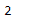

# Python |熊猫多指标类集。no velles

> 哎哎哎:1230〔https://www . geeksforgeeks . org/python 熊猫多指标类集调查-/t1〕

Python 是进行数据分析的优秀语言，主要是因为以数据为中心的 python 包的奇妙生态系统。 ***【熊猫】*** 就是其中一个包，让导入和分析数据变得容易多了。

熊猫 `**MultiIndex.nlevels**`属性返回多索引中的整数级别。

> **语法:**多索引

**示例#1:** 使用`MultiIndex.nlevels`属性查找多索引中的级别数。

```
# importing pandas as pd
import pandas as pd

# Creating the array
array = [[1, 2, 3], ['Sharon', 'Nick', 'Bailey']]

# Print the array
print(array)
```

**输出:**


现在让我们使用这个数组创建多索引

```
# Creating the MultiIndex
midx = pd.MultiIndex.from_arrays(array, names =('Number', 'Names'))

# Print the MultiIndex
print(midx)
```

**输出:**


现在我们将找到多索引中的级别数。

```
# Print the number of the levels in MultiIndex
midx.nlevels
```

**输出:**

正如我们在输出中看到的，midx MultiIndex 中有 2 个级别。

**示例 2:** 使用`MultiIndex.nlevels`属性查找给定多索引中的级别数。

```
# importing pandas as pd
import pandas as pd

# Creating the array
array = [[1, 2, 3], ['Sharon', 'Nick', 'Bailey'],
            ['Doctor', 'Scientist', 'Physicist']]

# Print the array
print(array)
```

**输出:**


现在让我们使用这个数组创建多索引

```
# Creating the MultiIndex
midx = pd.MultiIndex.from_arrays(array, 
          names =('Ranking', 'Names', 'Profession'))

# Print the MultiIndex
print(midx)
```

**输出:**


现在我们将找到多索引中的级别数。

```
# Print the number of level in MultiIndex
midx.nlevels
```

**输出:**

在输出中我们可以看到， *midx* MultiIndex 有 3 个等级。