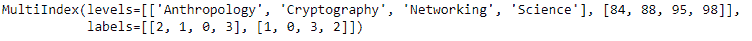
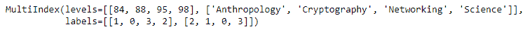
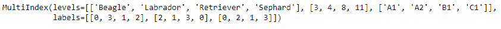
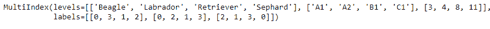

# Python | Pandas multi index . reorder _ levels()

> 原文:[https://www . geesforgeks . org/python-pandas-multi index-reorder _ levels/](https://www.geeksforgeeks.org/python-pandas-multiindex-reorder_levels/)

Python 是进行数据分析的优秀语言，主要是因为以数据为中心的 python 包的奇妙生态系统。 ***【熊猫】*** 就是其中一个包，让导入和分析数据变得容易多了。

熊猫 `**MultiIndex.reorder_levels()**`功能用于使用输入顺序重新排列等级。它可能不会降低或复制级别。该函数将列表作为输入，该列表包含多索引级别的所需顺序。

> **语法:** MultiIndex.reorder_levels(顺序)
> 
> **参数:**
> **顺序:**列表包含等级顺序
> 
> **返回:**一个新的多索引

**示例#1:** 使用`MultiIndex.reorder_levels()`函数对多索引的级别进行重新排序。

```
# importing pandas as pd
import pandas as pd

# Create the MultiIndex
midx = pd.MultiIndex.from_arrays([['Networking', 'Cryptography', 
                                     'Anthropology', 'Science'], 
                                             [88, 84, 98, 95]])

# Print the MultiIndex
print(midx)
```

**输出:**


现在让我们重新排列多索引的级别。

```
# reorder the levels such that
# 1st level appears before the 0th
midx.reorder_levels([1, 0])
```

**输出:**

正如我们在输出中看到的，该函数返回了一个新的 MultiIndex，其级别按照传递的顺序设置。

**示例 2:** 使用`MultiIndex.reorder_levels()`功能对多索引的级别进行重新排序。

```
# importing pandas as pd
import pandas as pd

# Create the MultiIndex
midx = pd.MultiIndex.from_arrays([['Beagle', 'Sephard', 'Labrador', 'Retriever'], 
                                       [8, 4, 11, 3], ['A1', 'B1', 'A2', 'C1']])

# Print the MultiIndex
print(midx)
```

**输出:**


现在让我们重新排列多索引的级别。

```
# reorder the levels
midx.reorder_levels([0, 2, 1])
```

**输出:**

正如我们在输出中看到的，该函数返回了一个新的 MultiIndex，其级别按照传递的顺序设置。