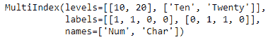

# Python | Pandas multi index . set _ labels()

> 原文:[https://www . geesforgeks . org/python-pandas-multi index-set _ labels/](https://www.geeksforgeeks.org/python-pandas-multiindex-set_labels/)

Python 是进行数据分析的优秀语言，主要是因为以数据为中心的 python 包的奇妙生态系统。 ***【熊猫】*** 就是其中一个包，让导入和分析数据变得容易多了。
熊猫 **MultiIndex.set_labels()** 功能在 MultiIndex 上设置新标签。默认返回新索引。

> **语法:**multi index . set _ labels(labels，level=None，inplace=False，verify_integrity=True)
> **参数:**
> **labels :** 要应用的新标签
> **level :** level 要设置的级别(所有级别均为 None)
> **in place:**如果为 True，则就地变异
> **verify_integrity :** 如果为 True，则检查级别和标签是否兼容

**示例#1:** 使用 MultiIndex.set_labels()函数重置 MultiIndex 的标签。

## 蟒蛇 3

```py
# importing pandas as pd
import pandas as pd

# Create the MultiIndex
midx = pd.MultiIndex.from_tuples([(10, 'Ten'), (10, 'Twenty'),
                                  (20, 'Ten'), (20, 'Twenty')],
                                       names =['Num', 'Char'])

# Print the MultiIndex
print(midx)
```

**输出:**


现在让我们重置多索引的标签。

## 蟒蛇 3

```py
# resetting the labels the MultiIndex
midx.set_labels([[1, 1, 0, 0], [0, 1, 1, 0]])
```

**输出:**



正如我们在输出中看到的，MultiIndex 的标签已经被重置。

**示例#2:** 使用 MultiIndex.set_labels()函数仅重置 MultiIndex 中的任何特定标签。

## 蟒蛇 3

```py
# importing pandas as pd
import pandas as pd

# Create the MultiIndex
midx = pd.MultiIndex.from_tuples([(10, 'Ten'), (10, 'Twenty'),
                                  (20, 'Ten'), (20, 'Twenty')],
                                        names =['Num', 'Char'])

# Print the MultiIndex
print(midx)
```

**输出:**


现在让我们重置多索引的“字符”标签。

## 蟒蛇 3

```py
# resetting the labels the MultiIndex
midx.set_labels([0, 1, 1, 0], level ='Char')
```

**输出:**


正如我们在输出中看到的，多索引的“字符”标签已经被重置为所需的值。