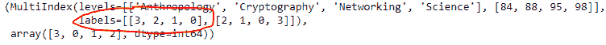

# Python | Pandas multi index . sort level()

> 原文:[https://www . geesforgeks . org/python-pandas-multi index-sort level/](https://www.geeksforgeeks.org/python-pandas-multiindex-sortlevel/)

Python 是进行数据分析的优秀语言，主要是因为以数据为中心的 python 包的奇妙生态系统。 ***【熊猫】*** 就是其中一个包，让导入和分析数据变得容易多了。

Pandas `**MultiIndex.sortlevel()**`函数在请求的级别对多索引进行排序。结果将尊重相关因素在该级别的原始顺序。

> **语法:**multi index . sort level(level = 0，升序=True，sort_remaining=True)
> 
> **参数:**
> **级别:**【list-like，int 或 str，缺省 0】如果给定一个字符串，必须是级别的名称如果 list-like 必须是级别的名称或 ints
> **升序:** False 按降序排序也可以是列表指定一个有向排序
> **sort_remaining :** 按级别后的剩余级别排序。
> 
> **返回:**
> **排序 _ 索引:**结果索引
> **索引器:**原始索引中输出值的索引

**示例#1:** 使用`MultiIndex.sortlevel()`函数按降序对多索引的第 0 级进行排序。

```py
# importing pandas as pd
import pandas as pd

# Create the MultiIndex
midx = pd.MultiIndex.from_arrays([['Networking', 'Cryptography', 
                                     'Anthropology', 'Science'],
                                             [88, 84, 98, 95]])

# Print the MultiIndex
print(midx)
```

**输出:**


现在让我们以降序对多索引的第 0 级进行排序。

```py
# sort the 0th level in descending order.
midx.sortlevel(level = 0, ascending = False)
```

**输出:**

正如我们在输出中看到的，该函数返回了一个新的对象，该对象的第 0 级按降序排序。

**示例 2:** 使用`MultiIndex.sortlevel()`功能按递增顺序对多索引的第一级进行排序。

```py
# importing pandas as pd
import pandas as pd

# Create the MultiIndex
midx = pd.MultiIndex.from_arrays([['Networking', 'Cryptography', 
                                     'Anthropology', 'Science'], 
                                             [88, 84, 98, 95]])

# Print the MultiIndex
print(midx)
```

**输出:**


现在让我们按照递增的顺序对多索引的第一级进行排序。

```py
# sort the 1st level of the MultiIndex in increasing order.
midx.sortlevel(level = 1, ascending = True)
```

**输出:**

正如我们在输出中看到的，函数返回了一个新的对象，该对象具有按递增顺序排序的第一级。