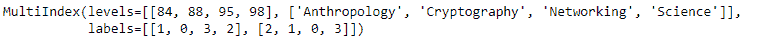

# Python | Pandas multi index . swaplevel()

> 原文:[https://www . geesforgeks . org/python-pandas-multi index-swaplevel/](https://www.geeksforgeeks.org/python-pandas-multiindex-swaplevel/)

Python 是进行数据分析的优秀语言，主要是因为以数据为中心的 python 包的奇妙生态系统。 ***【熊猫】*** 就是其中一个包，让导入和分析数据变得容易多了。

熊猫 `**MultiIndex.swaplevel()**`功能用于交换多索引的级别。调用这个方法不会改变值的顺序。

> **语法:** MultiIndex.swaplevel(i=-2，j=-1)
> 
> **参数:**
> **i :** 一级指标要对调。可以将级别名称作为字符串传递。参数类型可以混合。
> **j :** 要交换的第二级索引。可以将级别名称作为字符串传递。参数类型可以混合。
> 
> **返回:**一个新的多索引

**示例#1:** 使用`MultiIndex.swaplevel()`功能将多索引的第 0 级与第 1 级交换。

```
# importing pandas as pd
import pandas as pd

# Create the MultiIndex
midx = pd.MultiIndex.from_arrays([['Networking', 'Cryptography', 
                                     'Anthropology', 'Science'], 
                                             [88, 84, 98, 95]])

# Print the MultiIndex
print(midx)
```

**输出:**


现在让我们用多索引的第一级交换第 0 级。

```
# swap the levels
midx.swaplevel(0, 1)
```

**输出:**

正如我们在输出中看到的，该函数已经将多索引的第 0 级与第 1 级交换了。

**示例 2:** 使用`MultiIndex.swaplevel()`功能将多索引的第 0 级与第 1 级交换。

```
# importing pandas as pd
import pandas as pd

# Create the MultiIndex
midx = pd.MultiIndex.from_arrays([['Beagle', 'Sephard', 'Labrador', 'Retriever'],
                                       [8, 4, 11, 3], ['A1', 'B1', 'A2', 'C1']])

# Print the MultiIndex
print(midx)
```

**输出:**


现在让我们用多索引的第二级交换第 0 级。

```
# swap the levels
midx.swaplevel(0, 2)
```

**输出:**

正如我们在输出中看到的，该函数已经将 MultiIndex 的第 0 级和第 2 级进行了交换。