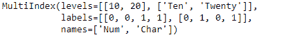
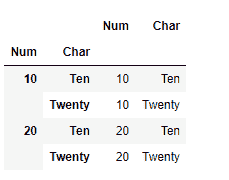
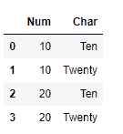

# Python | Pandas multi index . to _ frame()

> 原文:[https://www . geesforgeks . org/python-pandas-multi index-to _ frame/](https://www.geeksforgeeks.org/python-pandas-multiindex-to_frame/)

Python 是进行数据分析的优秀语言，主要是因为以数据为中心的 python 包的奇妙生态系统。 ***【熊猫】*** 就是其中一个包，让导入和分析数据变得容易多了。

熊猫 `**MultiIndex.to_frame()**`函数创建一个以多索引级别为列的数据框。

> **语法:**多索引到帧(索引=真)
> 
> **参数:**
> **索引:**将返回的数据帧的索引设置为原始的多索引。
> 
> **返回:**数据帧:包含原始多索引数据的数据帧。

**示例#1:** 使用`MultiIndex.to_frame()`函数使用多索引级别作为列和索引来构建数据框。

```
# importing pandas as pd
import pandas as pd

# Create the MultiIndex
midx = pd.MultiIndex.from_tuples([(10, 'Ten'), (10, 'Twenty'), 
                                  (20, 'Ten'), (20, 'Twenty')], 
                                        names =['Num', 'Char'])

# Print the MultiIndex
print(midx)
```

**输出:**


现在让我们从 MultiIndex 构造数据帧。

```
# Construct the DataFrame
midx.to_frame(index = True)
```

**输出:**

正如我们在输出中看到的，该函数已经使用 MultiIndex 构建了 Dataframe。请注意，数据帧的索引是使用 MultiIndex 的级别构造的。

**示例 2:** 使用`MultiIndex.to_frame()`函数使用多索引构建数据帧。不要使用多索引级别来构造数据框的索引。

```
# importing pandas as pd
import pandas as pd

# Create the MultiIndex
midx = pd.MultiIndex.from_tuples([(10, 'Ten'), (10, 'Twenty'),  
                                  (20, 'Ten'), (20, 'Twenty')], 
                                        names =['Num', 'Char'])

# Print the MultiIndex
print(midx)
```

**输出:**


现在让我们使用 *midx* 多索引创建一个数据帧。

```
# Create Dataframe with new index values.
midx.to_frame(index = False)
```

**输出:**

正如我们在输出中看到的，函数返回了一个具有不同索引值的数据帧。