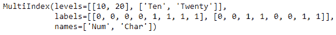
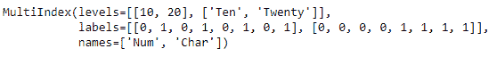

# Python | Pandas multi index . to _ hierarchy()

> 原文:[https://www . geesforgeks . org/python-pandas-multi index-to _ hierarchy/](https://www.geeksforgeeks.org/python-pandas-multiindex-to_hierarchical/)

Python 是进行数据分析的优秀语言，主要是因为以数据为中心的 python 包的奇妙生态系统。 ***【熊猫】*** 就是其中一个包，让导入和分析数据变得容易多了。

Pandas `**MultiIndex.to_hierarchical()**`函数返回一个多索引，该索引被重新整形以符合 n_repeat 和 n_shuffle 给定的形状。复制并重新排列一个多索引，以便与另一个具有 n 个重复项的索引组合，这是很有用的。

> **语法:**multi index . to _ hierarchy(n _ repeat，n_shuffle=1)
> 
> **参数:**
> **n_repeat :** 在 self 上重复标签的次数
> **n_shuffle :** 控制标签的重新排序。如果结果是多索引中的内部级别，n_shuffle 将需要大于 1。每个标签的大小必须能被 n_shuffle 整除
> 
> **返回:**多索引

**示例#1:** 使用`MultiIndex.to_hierarchical()`功能重复多索引中的标签。

```
# importing pandas as pd
import pandas as pd

# Create the MultiIndex
midx = pd.MultiIndex.from_tuples([(10, 'Ten'), (10, 'Twenty'),
                                  (20, 'Ten'), (20, 'Twenty')], 
                                       names =['Num', 'Char'])

# Print the MultiIndex
print(midx)
```

**输出:**


现在让我们重复多索引的标签两次。

```
# repeat the labels in the MultiIndex 2 times.
midx.to_hierarchical(n_repeat = 2)
```

**输出:**

正如我们在输出中看到的，返回的 MultiIndex 中的标签重复了 2 次。

**示例 2:** 使用`MultiIndex.to_hierarchical()`功能重复并重新排列多索引中的标签。

```
# importing pandas as pd
import pandas as pd

# Create the MultiIndex
midx = pd.MultiIndex.from_tuples([(10, 'Ten'), (10, 'Twenty'), 
                                 (20, 'Ten'), (20, 'Twenty')],
                                       names =['Num', 'Char'])

# Print the MultiIndex
print(midx)
```

**输出:**


现在，让我们重复和重新洗牌的标签的多重索引 2 次。

```
# resetting the labels the MultiIndex
midx.to_hierarchical(n_repeat = 2, n_shuffle = 2)
```

**输出:**

正如我们在输出中看到的，标签在返回的 MultiIndex 中被重复以及重新洗牌两次。