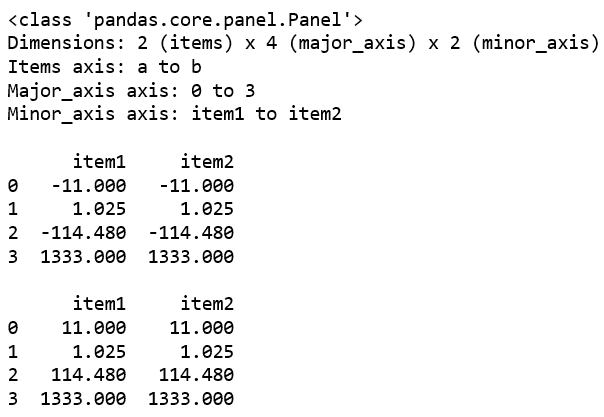
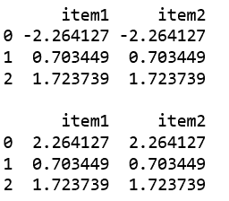

# 蟒蛇|熊猫 pants . ABS()

> 原文:[https://www.geeksforgeeks.org/python-pandas-panel-abs/](https://www.geeksforgeeks.org/python-pandas-panel-abs/)

在熊猫中，面板是一个非常重要的三维数据容器。三个轴的名称旨在为描述涉及面板数据的操作，特别是面板数据的计量经济学分析提供一些语义含义。

`**Panel.abs()**` 函数用于返回每个元素的绝对数值的序列/数据帧。

> **语法:** Panel.abs()
> 
> **参数:**无
> 
> **返回:**包含每个元素绝对值的序列/数据帧。

**代码#1:**

```
# importing pandas module 
import pandas as pd 
import numpy as np

df1 = pd.DataFrame({'a': ['Geeks', 'For', 'geeks', 'real'], 
                    'b': [-11, +1.025, -114.48, 1333]})

data = {'item1':df1, 'item2':df1}

# creating Panel 
panel = pd.Panel.from_dict(data, orient ='minor')
print(panel, "\n")
print(panel['b'], '\n')

print(panel['b'].abs())
```

**输出:**


**代码#2:**

```
# importing pandas module 
import pandas as pd 
import numpy as np

df1 = pd.DataFrame({'a': ['Geeks', 'For', 'geeks'], 
                    'b': np.random.randn(3)})

data = {'item1':df1, 'item2':df1}

# creating Panel 
panel = pd.Panel.from_dict(data, orient ='minor')

print(panel['b'])

df2 = pd.DataFrame({'b': [11, 12, 13]})
print(panel['b'].abs())
```

**输出:**
