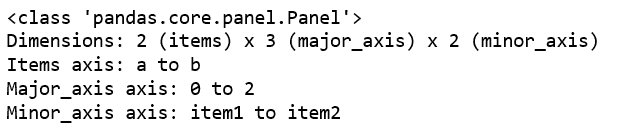
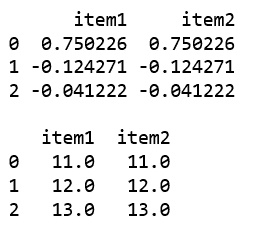
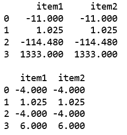

# 蟒蛇|熊猫面板. clip()

> 原文:[https://www.geeksforgeeks.org/python-pandas-panel-clip/](https://www.geeksforgeeks.org/python-pandas-panel-clip/)

在熊猫中，面板是一个非常重要的三维数据容器。三个轴的名称旨在为描述涉及面板数据的操作，特别是面板数据的计量经济学分析提供一些语义含义。

`**Panel.clip()**`功能用于调整输入阈值的值。阈值可以是奇异值或类似数组的值。

> **语法:** Panel.clip(下=无，上=无，轴=无，在位=假，*args，* * * kwargs)
> 
> **参数:**参数:
> T3】下限:最小阈值。低于此阈值的所有值都将被设置为该值。
> **上限:**最大阈值。高于此阈值的所有值都将被设置为该值。
> **轴:**沿给定轴上下对齐对象。
> **到位:**是否对数据执行到位操作。
> 
> **返回:**【序列或数据帧】与调用对象类型相同，只是片段边界之外的值被替换。

**代码#1:** 使用 from_dict()创建面板

```py
# importing pandas module 
import pandas as pd 
import numpy as np

df1 = pd.DataFrame({'a': ['Geeks', 'For', 'geeks'], 
                    'b': np.random.randn(3)})

data = {'item1':df1, 'item2':df1}

# creating Panel 
panel = pd.Panel.from_dict(data, orient ='minor')
print(panel)
```

**输出:**


**代码#2:** 使用 clip()功能

```py
# importing pandas module 
import pandas as pd 
import numpy as np

df1 = pd.DataFrame({'a': ['Geeks', 'For', 'geeks'], 
                    'b': np.random.randn(3)})

data = {'item1':df1, 'item2':df1}

# creating Panel 
panel = pd.Panel.from_dict(data, orient ='minor')

print(panel['b'], '\n')

df2 = pd.DataFrame({'b': [11, 12, 13]})
print(panel['b'].clip(df2['b'], axis = 0))
```

**输出:**


**代码#3:** 使用 clip()功能

```py
# importing pandas module 
import pandas as pd 
import numpy as np

df1 = pd.DataFrame({'a': ['Geeks', 'For', 'geeks', 'real'], 
                    'b': [-11, +1.025, -114.48, 1333]})

data = {'item1':df1, 'item2':df1}

# creating Panel 
panel = pd.Panel.from_dict(data, orient ='minor')

print(panel['b'], '\n')

print(panel['b'].clip(-4, 6))
```

**输出:**
