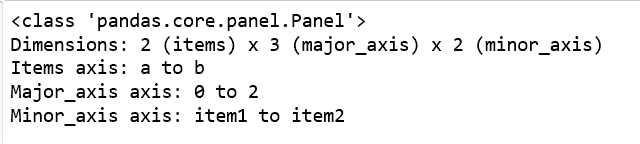
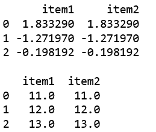
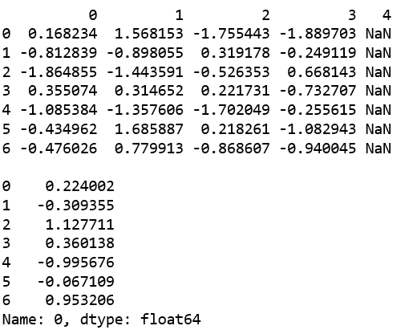

# 蟒蛇|熊猫面板. clip _ low()

> 原文:[https://www . geesforgeks . org/python-pandas-pants-panel-clip _ low/](https://www.geeksforgeeks.org/python-pandas-panel-clip_lower/)

在熊猫中，面板是一个非常重要的三维数据容器。三个轴的名称旨在为描述涉及面板数据的操作，特别是面板数据的计量经济学分析提供一些语义含义。

`**Panel.clip_lower()**`函数用于返回值低于截断阈值的输入副本。

> **语法:**panel . clip _ low(阈值，轴=无，在位=假)
> 
> **参数:**
> **阈值:**允许的最小值。低于阈值的所有值都将设置为该值。
> **浮动:**将每个值与阈值进行比较。
> **阵列状:**阈值的形状应该与其比较的对象相匹配。
> **轴:**沿给定轴将自身与阈值对齐。
> **到位:**是否对数据执行到位操作。
> 
> **返回:**与输入类型相同。

**代码#1:** 使用 from_dict()创建面板

```
# importing pandas module 
import pandas as pd 
import numpy as np

df1 = pd.DataFrame({'a': ['Geeks', 'For', 'geeks'], 
                    'b': np.random.randn(3)})

data = {'item1':df1, 'item2':df1}

# creating Panel 
panel = pd.Panel.from_dict(data, orient ='minor')
print(panel, "\n")
```

**输出:**


**代码#2:** 使用 clip_lower()

```
# importing pandas module 
import pandas as pd 
import numpy as np

df1 = pd.DataFrame({'a': ['Geeks', 'For', 'geeks'], 
                    'b': np.random.randn(3)})

data = {'item1':df1, 'item2':df1}

# creating Panel 
panel = pd.Panel.from_dict(data, orient ='minor')
print(panel, "\n")
print(panel['b'], '\n')

df2 = pd.DataFrame({'b': [11, 12, 13]})
print(panel['b'].clip_lower(df2['b'], axis = 0))
```

**输出:**


**代码#3:**

```
# creating an empty panel
import pandas as pd
import numpy as np

data = {'Item1' : pd.DataFrame(np.random.randn(7, 4)), 
        'Item2' : pd.DataFrame(np.random.randn(4, 5))}

pen = pd.Panel(data)
print(pen['Item1'], '\n')

p = pen['Item1'][0].clip_lower(np.random.randn(7))
print(p)
```

**输出:**
