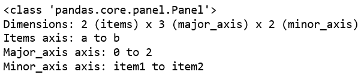
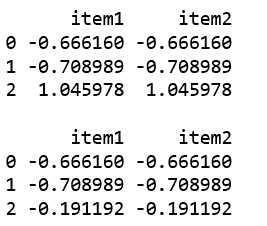
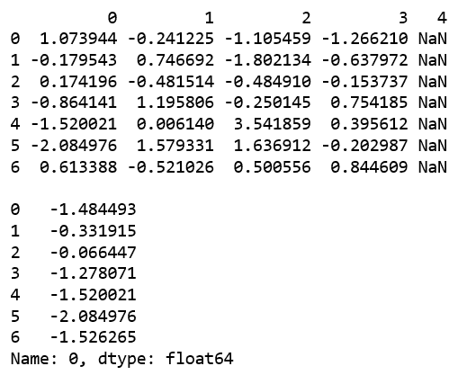

# 蟒蛇|熊猫面板. clip_upper()

> 原文:[https://www . geesforgeks . org/python-pandas-pants-panel-clip _ upper/](https://www.geeksforgeeks.org/python-pandas-panel-clip_upper/)

在熊猫中，面板是一个非常重要的三维数据容器。三个轴的名称旨在为描述涉及面板数据的操作，特别是面板数据的计量经济学分析提供一些语义含义。

`**Panel.clip_upper()**`函数用于返回给定值以上的值被截断的输入副本。

> **语法:** Panel.clip_upper(阈值，轴=无，在位=假)
> 
> **参数:**
> **阈值:**像
> **轴一样浮动或阵列:**沿给定轴将对象与阈值对齐。
> **到位:**是否对数据执行到位操作
> 
> **返回:**与输入类型相同。

**创建面板:**

```
# importing pandas module 
import pandas as pd 
import numpy as np

df1 = pd.DataFrame({'a': ['Geeks', 'For', 'geeks'], 
                    'b': np.random.randn(3)})

data = {'item1':df1, 'item2':df1}

# creating Panel 
panel = pd.Panel.from_dict(data, orient ='minor')
print(panel, "\n")
```

**输出:**


**代码#1:** 使用 clip_upper()

```
# importing pandas module 
import pandas as pd 
import numpy as np

df1 = pd.DataFrame({'a': ['Geeks', 'For', 'geeks'], 
                    'b': np.random.randn(3)})

data = {'item1':df1, 'item2':df1}

# creating Panel 
panel = pd.Panel.from_dict(data, orient ='minor')
print(panel, "\n")
print(panel['b'], '\n')

df2 = pd.DataFrame({'b': np.random.randn(5)})
print(panel['b'].clip_upper(df2['b'], axis = 0))
```

**输出:**


**代码#2:** 使用 clip_upper()

```
# creating an empty panel
import pandas as pd
import numpy as np

data = {'Item1' : pd.DataFrame(np.random.randn(7, 4)), 
        'Item2' : pd.DataFrame(np.random.randn(4, 5))}

pen = pd.Panel(data)
print(pen['Item1'], '\n')

p = pen['Item1'][0].clip_upper(np.random.randn(7))
print(p)
```

**输出:**
