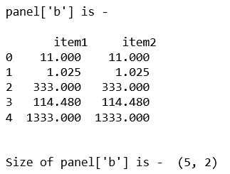
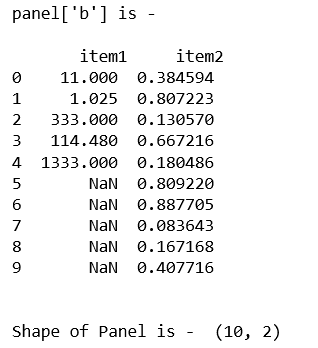
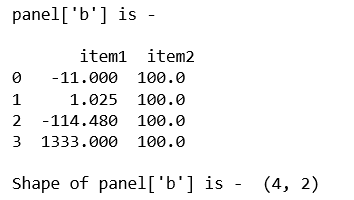

# 蟒蛇|熊猫面板.形状

> 原文:[https://www.geeksforgeeks.org/python-pandas-panel-shape/](https://www.geeksforgeeks.org/python-pandas-panel-shape/)

在熊猫中，面板是一个非常重要的三维数据容器。三个轴的名称旨在为描述涉及面板数据的操作，特别是面板数据的计量经济学分析提供一些语义含义。在熊猫中 **Panel.shape** 可以用来获得轴维度的元组。

> **语法:** Panel.shape
> **参数:** None
> **返回:**返回轴维度的元组

**代码#1:**

## 蟒蛇 3

```py
# importing pandas module 
import pandas as pd 
import numpy as np

df1 = pd.DataFrame({'a': ['Geeks', 'For', 'geeks', 'for', 'real'], 
                    'b': [11, 1.025, 333, 114.48, 1333]})

data = {'item1':df1, 'item2':df1}

# creating Panel 
panel = pd.Panel.from_dict(data, orient ='minor')

print("panel['b'] is - \n\n", panel['b'], '\n')

print("\nSize of panel['b'] is - ", panel['b'].shape)  
```

**输出:**



**代码#2:**

## 蟒蛇 3

```py
# importing pandas module 
import pandas as pd 
import numpy as np

df1 = pd.DataFrame({'a': ['Geeks', 'For', 'geeks', 'for', 'real'], 
                    'b': [11, 1.025, 333, 114.48, 1333]})

# Create a 5 * 5 dataframe
df2 = pd.DataFrame(np.random.rand(10, 2), columns =['a', 'b'])

data = {'item1':df1, 'item2':df2}

# creating Panel 
panel = pd.Panel.from_dict(data, orient ='minor')
print("panel['b'] is - \n\n", panel['b'], '\n')

print("\nShape of Panel is - ", panel['b'].shape)
```

**输出:**



**代码#3:**

## 蟒蛇 3

```py
# importing pandas module
import pandas as pd
import numpy as np

df1 = pd.DataFrame({'a': ['Geeks', 'For', 'geeks', 'real'],
                    'b': [-11, +1.025, -114.48, 1333]})

df2 = pd.DataFrame({'a': ['I', 'am', 'dataframe', 'two'],
                    'b': [100, 100, 100, 100]})

data = {'item1':df1, 'item2':df2}

# creating Panel
panel = pd.Panel.from_dict(data, orient ='minor')
print("panel['b'] is - \n\n", panel['b'])

print("\nShape of panel['b'] is - ",  panel['b'].shape)
```

**输出:**



**注意:**面板已经从熊猫模块 0.25.0 开始移除。

## 蟒蛇 3

```py
#To check the version of pandas library
import pandas
print(pandas.__version__)
```