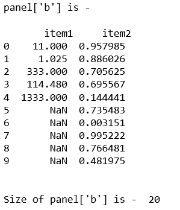
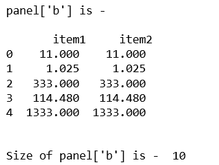
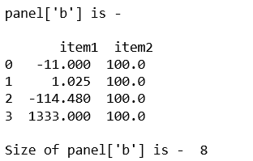

# 蟒蛇|熊猫面板.尺寸

> 原文:[https://www.geeksforgeeks.org/python-pandas-panel-size/](https://www.geeksforgeeks.org/python-pandas-panel-size/)

在熊猫中，面板是一个非常重要的三维数据容器。三个轴的名称旨在为描述涉及面板数据的操作，特别是面板数据的计量经济学分析提供一些语义含义。

在熊猫 **`Panel.size`** 中给出了数列的行数。否则返回行数乘以列数。

> **语法:**面板大小
> 
> **参数:**无
> 
> **返回:**返回表示该对象中元素数量的 int 值。

**代码#1:**

```py
# importing pandas module  
import pandas as pd  
import numpy as np 

df1 = pd.DataFrame({'a': ['Geeks', 'For', 'geeks', 'for', 'real'],  
                    'b': [11, 1.025, 333, 114.48, 1333]}) 

print("df1 is - \n\n", df1)

# Create a 5 * 5 dataframe 
df2 = pd.DataFrame(np.random.rand(10, 2), columns =['a', 'b']) 
print("df2 is - \n\n", df2)
```


现在，让我们使用 df1 和 df2 的 dict 创建面板，并获得该面板的大小。

```py
data = {'item1':df1, 'item2':df2} 

# creating Panel  
panel = pd.Panel.from_dict(data, orient ='minor') 
print("panel['b'] is - \n\n", panel['b'], '\n') 

print("\nSize of panel['b'] is - ", panel['b'].size) 
```

**输出:**


**代码#2:**

```py
# importing pandas module  
import pandas as pd  
import numpy as np 

df1 = pd.DataFrame({'a': ['Geeks', 'For', 'geeks', 'for', 'real'],  
                    'b': [11, 1.025, 333, 114.48, 1333]}) 

data = {'item1':df1, 'item2':df1} 

# creating Panel  
panel = pd.Panel.from_dict(data, orient ='minor') 

print("panel['b'] is - \n\n", panel['b'], '\n') 

print("\nSize of panel['b'] is - ", panel['b'].size)   
```

**输出:**


**代码#3:**

```py
# importing pandas module 
import pandas as pd 
import numpy as np 

df1 = pd.DataFrame({'a': ['Geeks', 'For', 'geeks', 'real'], 
                    'b': [-11, +1.025, -114.48, 1333]}) 

df2 = pd.DataFrame({'a': ['I', 'am', 'dataframe', 'two'], 
                    'b': [100, 100, 100, 100]}) 

data = {'item1':df1, 'item2':df2}

# creating Panel 
panel = pd.Panel.from_dict(data, orient ='minor') 
print("panel['b'] is - \n\n", panel['b']) 

print("\nSize of panel['b'] is - ",  panel['b'].size) 
```

**输出:**
