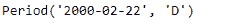
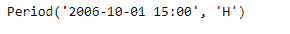

# 蟒蛇|熊猫时期

> 原文:[https://www.geeksforgeeks.org/python-pandas-period-asfreq/](https://www.geeksforgeeks.org/python-pandas-period-asfreq/)

Python 是进行数据分析的优秀语言，主要是因为以数据为中心的 python 包的奇妙生态系统。 ***【熊猫】*** 就是其中一个包，让导入和分析数据变得容易多了。

熊猫 `**Period.asfreq()**`功能用于在间隔开始或结束时将周期转换为所需频率。

> **语法:**句点. asfreq()
> 
> **参数:**
> **freq :** 字符串
> **如何:**时间跨度的开始或结束
> 
> **返回:**重新采样:周期

**示例#1:** 使用`Period.asfreq()`功能将给定时间段的频率从“秒”更改为“天”

```py
# importing pandas as pd
import pandas as pd

# Create the Period object
prd = pd.Period(freq ='S', year = 2000, month = 2, day = 22,
                        hour = 8, minute = 21, second = 24)

# Print the Period object
print(prd)
```

**输出:**


现在我们将使用`Period.asfreq()`功能将 prd 对象的频率更改为“每日频率”。

```py
# change the frequency
prd.asfreq(freq ='D')
```

**输出:**



正如我们在输出中看到的，`Period.asfreq()`功能已经成功地将给定对象的频率更改为所需的频率。

**示例 2:** 使用`Period.asfreq()`功能将给定时间段的频率从“秒”更改为“小时”

```py
# importing pandas as pd
import pandas as pd

# Create the Period object
prd = pd.Period(freq ='S', year = 2006, month = 10, 
               hour = 15, minute = 49, second = 17)

# Print the object
print(prd)
```

**输出:**


现在我们将使用`Period.asfreq()`功能将 prd 对象的频率更改为“每小时频率”。

```py
# change the frequency
prd.asfreq(freq ='H')
```

**输出:**


正如我们在输出中看到的，`Period.asfreq()`功能已经成功地将给定对象的频率更改为所需的频率。