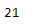
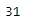

# 蟒蛇|熊猫句号.日

> 原文:[https://www.geeksforgeeks.org/python-pandas-period-day/](https://www.geeksforgeeks.org/python-pandas-period-day/)

Python 是进行数据分析的优秀语言，主要是因为以数据为中心的 python 包的奇妙生态系统。 ***【熊猫】*** 就是其中一个包，让导入和分析数据变得容易多了。

熊猫 `**Period.day**` 属性返回给定周期对象的月份。它返回一个整数值。

> **语法:**句点. day
> 
> **参数:**无
> 
> **返程:**天

**示例#1:** 使用`Period.day`属性在给定的 Period 对象中查找日期。

```
# importing pandas as pd
import pandas as pd

# Create the Period object
prd = pd.Period(freq ='D', year = 2001, month = 1, day = 21)

# Print the Period object
print(prd)
```

**输出:**


现在我们将使用`Period.day`属性来查找给定对象中的月日。

```
# return the day value 
prd.day
```

**输出:**



我们可以在输出中看到，`Period.day`属性返回了 21，这是给定周期对象中的日值。

**示例#2:** 使用`Period.day`属性在给定的 Period 对象中查找日期。

```
# importing pandas as pd
import pandas as pd

# Create the Period object
prd = pd.Period(freq ='Q', year = 2006, quarter = 1)

# Print the object
print(prd)
```

**输出:**


现在我们将使用`Period.day`属性来查找给定对象中的月日。

```
# return the day value 
prd.day
```

**输出:**



我们可以在输出中看到，`Period.day`属性返回了 31，这是给定周期对象中的日值。