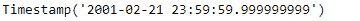
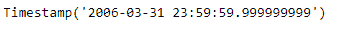

# 蟒蛇|熊猫 Period.end_time

> 原文:[https://www . geesforgeks . org/python-pandas-period-end _ time/](https://www.geeksforgeeks.org/python-pandas-period-end_time/)

Python 是进行数据分析的优秀语言，主要是因为以数据为中心的 python 包的奇妙生态系统。 ***【熊猫】*** 就是其中一个包，让导入和分析数据变得容易多了。

Pandas `**Period.end_time**`属性返回一个包含给定周期对象结束时间的 Timestamp 对象。

> **语法:** Period.end_time
> 
> **参数:**无
> 
> **返回:**时间戳对象

**示例#1:** 使用`Period.end_time`属性查找给定周期对象的结束时间。

```
# importing pandas as pd
import pandas as pd

# Create the Period object
prd = pd.Period(freq ='D', year = 2001, month = 2, day = 21)

# Print the Period object
print(prd)
```

**输出:**


现在我们将使用`Period.end_time`属性来查找 prd 对象的结束时间。

```
# return the end time
prd.end_time
```

**输出:**



正如我们在输出中看到的那样，`Period.end_time` 属性返回了一个 Timestamp 对象，该对象包含日期值以及给定时间段的结束时间。

**示例#2:** 使用`Period.end_time`属性查找给定周期对象的结束时间。

```
# importing pandas as pd
import pandas as pd

# Create the Period object
prd = pd.Period(freq ='Q', year = 2006, quarter = 1)

# Print the object
print(prd)
```

**输出:**


现在我们将使用`Period.end_time`属性来查找 prd 对象的结束时间。

```
# return the end time
prd.end_time
```

**输出:**


正如我们在输出中看到的那样，`Period.end_time` 属性返回了一个 Timestamp 对象，该对象包含日期值以及给定周期对象的结束时间。