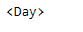
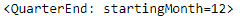

# 蟒蛇|熊猫时期. freq

> 原文:[https://www.geeksforgeeks.org/python-pandas-period-freq/](https://www.geeksforgeeks.org/python-pandas-period-freq/)

Python 是进行数据分析的优秀语言，主要是因为以数据为中心的 python 包的奇妙生态系统。 ***【熊猫】*** 就是其中一个包，让导入和分析数据变得容易多了。

熊猫 `**Period.freq**`属性返回应用于给定周期对象的频率。

> **语法:**句点. freq
> 
> **参数:**无
> 
> **返回:**频率

**示例#1:** 使用`Period.freq`属性查找应用于给定周期对象的时间序列频率。

```
# importing pandas as pd
import pandas as pd

# Create the Period object
prd = pd.Period(freq ='D', year = 2001, month = 2, day = 21)

# Print the Period object
print(prd)
```

**输出:**


现在我们将使用`Period.freq`属性来查找应用于 prd 对象的频率。

```
# return the frequency
prd.freq
```

**输出:**


我们可以在输出中看到，`Period.freq` 属性返回了‘Day’，表示应用于给定对象的时间序列频率是 Day。

**示例#2:** 使用`Period.freq`属性查找应用于给定周期对象的时间序列频率。

```
# importing pandas as pd
import pandas as pd

# Create the Period object
prd = pd.Period(freq ='Q', year = 2006, quarter = 1)

# Print the object
print(prd)
```

**输出:**


现在我们将使用`Period.freq`属性来查找应用于 prd 对象的频率。

```
# return the frequency
prd.freq
```

**输出:**


正如我们在输出中看到的，`Period.freq` 属性返回了“季度结束”，表示应用于给定对象的时间序列频率是“季度”。