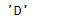
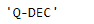

# 蟒蛇|熊猫时期. freqstr

> 原文:[https://www.geeksforgeeks.org/python-pandas-period-freqstr/](https://www.geeksforgeeks.org/python-pandas-period-freqstr/)

Python 是进行数据分析的优秀语言，主要是因为以数据为中心的 python 包的奇妙生态系统。 ***【熊猫】*** 就是其中一个包，让导入和分析数据变得容易多了。

Pandas `**Period.freqstr**`属性返回应用于给定周期对象的时间序列频率的字符串别名。

> **语法:** Period.freqstr
> 
> **参数:**无
> 
> **返回:**字符串

**示例#1:** 使用`Period.freqstr`属性查找应用于给定周期对象的时间序列频率的字符串别名。

```py
# importing pandas as pd
import pandas as pd

# Create the Period object
prd = pd.Period(freq ='D', year = 2001, month = 2, day = 21)

# Print the Period object
print(prd)
```

**输出:**


现在我们将使用`Period.freqstr`属性来查找应用于 prd 对象的频率的字符串别名。

```py
# return the string alias of the frequency
prd.freqstr
```

**输出:**



正如我们在输出中看到的那样，`Period.freqstr` 属性返回了‘D’，表示应用于给定对象的时间序列频率是日。

**示例#2:** 使用`Period.freqstr`属性查找应用于给定周期对象的时间序列频率的字符串别名。

```py
# importing pandas as pd
import pandas as pd

# Create the Period object
prd = pd.Period(freq ='Q', year = 2006, quarter = 1)

# Print the object
print(prd)
```

**输出:**


现在我们将使用`Period.freqstr`属性来查找应用于 prd 对象的频率的字符串别名。

```py
# return the string alias of the frequency
prd.freqstr
```

**输出:**



正如我们在输出中看到的，`Period.freqstr` 属性返回了‘Q-DEC’，表示应用于给定对象的时间序列频率是一年的季末。