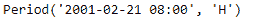
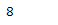
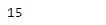

# 蟒蛇|熊猫句号.小时

> 原文:[https://www.geeksforgeeks.org/python-pandas-period-hour/](https://www.geeksforgeeks.org/python-pandas-period-hour/)

Python 是进行数据分析的优秀语言，主要是因为以数据为中心的 python 包的奇妙生态系统。 ***【熊猫】*** 就是其中一个包，让导入和分析数据变得容易多了。

Pandas **Period.hour** 属性返回一个整数值，表示给定 Period 对象中的小时值。

> **语法:**周期.小时
> T3】参数:无
> T6】返回:小时值

**示例#1:** 使用 Period.hour 属性查找给定 Period 对象中的小时值。

## 蟒蛇 3

```
# importing pandas as pd
import pandas as pd

# Create the Period object
prd = pd.Period(freq ='H', year = 2001, month = 2, day = 21, hour = 8)

# Print the Period object
print(prd)
```

**输出:**



现在我们将使用 Period.hour 属性来查找 prd 对象中的小时值。

## 蟒蛇 3

```
# return the hour value
prd.hour
```

**输出:**



正如我们在输出中看到的，Period.hour 属性返回了“8”，表示下面对象中的小时值是 8。

**示例#2:** 使用 Period.hour 属性查找给定 Period 对象中的小时值。

## 蟒蛇 3

```
# importing pandas as pd
import pandas as pd

# Create the Period object
prd = pd.Period(freq ='T', year = 2006, month = 10, hour = 15, minute = 49)

# Print the Period object
print(prd)
```

**输出:**


现在我们将使用 Period.hour 属性来查找 prd 对象中的小时值。

## 蟒蛇 3

```
# return the hour value
prd.hour
```

**输出:**



正如我们在输出中看到的，Period.hour 属性返回了“15”，表示下面对象中的小时值是 15。