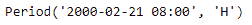
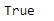
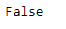

# 蟒蛇|熊猫 Period.is_leap_year

> 原文:[https://www . geesforgeks . org/python-pandas-period-is _ leap _ year/](https://www.geeksforgeeks.org/python-pandas-period-is_leap_year/)

Python 是进行数据分析的优秀语言，主要是因为以数据为中心的 python 包的奇妙生态系统。 ***【熊猫】*** 就是其中一个包，让导入和分析数据变得容易多了。

熊猫 `**Period.is_leap_year**`属性检查给定的 Period 对象，对象中的年份是否是闰年。如果下一年是闰年，它会返回`True`，否则它会返回`False`

> **语法:** Period.is_leap_year
> 
> **参数:**无
> 
> **返回:**布尔值

**示例#1:** 使用`Period.is_leap_year` 属性检查给定周期对象中的日期是否为闰年。

```py
# importing pandas as pd
import pandas as pd

# Create the Period object
prd = pd.Period(freq ='H', year = 2000, month = 2, day = 21, hour = 8)

# Print the Period object
print(prd)
```

**输出:**


现在我们将使用`Period.is_leap_year`属性来检查 prd 对象中的日期是否是闰年。

```py
# check for leap year
prd.is_leap_year
```

**输出:**



在输出中我们可以看到，`Period.is_leap_year` 属性已经返回了`True`，表示 prd 对象中的下一年是闰年。

**示例 2:** 使用`Period.is_leap_year`属性检查给定周期对象中的日期是否为闰年。

```py
# importing pandas as pd
import pandas as pd

# Create the Period object
prd = pd.Period(freq ='T', year = 2006, month = 10, hour = 15, minute = 49)

# Print the Period object
print(prd)
```

**输出:**


现在我们将使用`Period.is_leap_year`属性来检查 prd 对象中的日期是否是闰年。

```py
# check for leap year
prd.is_leap_year
```

**输出:**



在输出中我们可以看到，`Period.is_leap_year` 属性已经返回了`False`，表示 prd 对象中的下一年不是闰年。